# Task Plan for January 6, 2025 (Revised)

## 完成情况总结
- ✅ **Task 1: 技术债务清理** - 已完成 (PR #177)
- ✅ **Task 2: 分享功能完整实现** - 已完成 (PR #185)
- ✅ **Task 3: Claude会话管理系统（后端）** - 已完成 (PR #175)
- ✅ **Task 4: 会话状态轮询系统（后端）** - 已完成 (PR #175)
- ❌ **Task 5: 聊天界面增强（前端UI）** - 未完成
- ❌ **Task 6: Claude执行模拟器** - 未完成

## Overview

根据 MVP 分析和技术债务情况，调整今天的任务优先级：

1. **技术债务清理**: 先解决 knip 检测到的未使用代码（影响代码质量）
2. **Story 3**: 完善文档分享功能（Phase 5 - 仅剩 UI 部分）
3. **Story 2**: AI 文档编辑功能基础设施（Phase 4 - 核心 MVP 功能）

## 现状分析

### ✅ 已完成

- 所有基础设施（YJS、Blob、认证）
- 所有 CLI 开发工具（pull/push）
- Web 界面基础（项目管理、文件浏览器、文档查看器）
- 分享 API 端点和公开查看页面
- watch-claude 命令（CLI 侧）

### ❌ MVP 关键缺失

**技术债务**（来自 tech-debt.md）：

- ✅ 6 个未使用的文件需要清理（已完成 PR #167, #168）
- ✅ 多个未使用的依赖需要移除（已完成 PR #177）
- ✅ 未使用的导出需要清理（已完成 PR #168, #177）

**Story 3 - 文档分享**（验收标准）：

- ✅ 文档查看器中的"分享"按钮 (已完成 PR #185)
- ✅ 分享管理界面 (已完成 PR #185)

**Story 2 - AI 文档编辑**（验收标准）：

- ❌ Chat 界面实际功能（UI 存在但无功能）
- ❌ 实时执行状态指示器
- ❌ Claude 修改时的实时文档更新
- ❌ E2B 容器运行时集成

## 7 个任务（根据设计文档重新划分）

### Task 1: 技术债务清理 ✅

**类型**: 代码质量  
**耗时**: 1 小时  
**依赖**: 无  
**状态**: ✅ 已完成 (PR #177 已合并)

#### 实现内容：

1. ✅ 运行 `cd turbo && pnpm knip` 检查当前状态
2. ✅ 删除 6 个未使用的文件
3. ✅ 移除未使用的 npm 依赖
4. ✅ 运行 `pnpm install` 更新 lock 文件
5. ✅ 运行所有检查：lint, type-check, test

#### 完成细节：
- 保留了 `@ts-rest/core` 在 packages/core（契约文件需要）
- 删除了 5 个未使用的依赖
- 删除了 3 个未使用的 devDependencies
- 修复了 9 个未使用的导出类型
- 添加了缺失的 eslint 依赖

---

### Task 2: 分享功能完整实现（前后端一体） ✅

**类型**: 全栈功能  
**耗时**: 2.5 小时  
**依赖**: 无（现有 share API 已可用）
**状态**: ✅ 已完成 (PR #185 已合并)

#### 实现内容：

1. **分享按钮**（30 分钟）：

   - ✅ 修改 `/turbo/apps/web/app/projects/[id]/page.tsx`
   - ✅ 添加分享按钮，调用现有 POST `/api/shares`
   - ✅ 复制链接功能

2. **分享管理 API**（1 小时）：

   - ✅ 创建 GET `/api/shares` - 列出用户所有分享
   - ✅ 创建 DELETE `/api/shares/[id]` - 撤销分享

3. **分享管理页面**（1 小时）：
   - ✅ 创建 `/turbo/apps/web/app/settings/shares/page.tsx`
   - ✅ 显示分享列表，支持删除操作

#### 创建文件：

- ✅ `/turbo/apps/web/app/api/shares/route.ts`
- ✅ `/turbo/apps/web/app/api/shares/[id]/route.ts`
- ✅ `/turbo/apps/web/app/settings/shares/page.tsx`

#### 修改文件：

- ✅ `/turbo/apps/web/app/projects/[id]/page.tsx`

---

### Task 3: Claude 会话管理系统（独立模块） ✅

**类型**: 后端基础设施  
**耗时**: 1.5 小时  
**依赖**: 无
**状态**: ✅ 已完成 (PR #175 已合并)

#### 实现内容：

1. **会话管理 API**：

   - ✅ POST `/api/projects/[id]/sessions` - 创建会话
   - ✅ POST `/api/projects/[id]/sessions/[id]/interrupt` - 打断会话
   - ✅ PATCH `/api/projects/[id]/sessions/[id]` - 更新状态
   - ✅ GET `/api/projects/[id]/sessions/[id]` - 查询状态
   - ✅ 完整的 turns 和 blocks API 已实现

2. **数据模型**：
   - ✅ 一个 project 下有多个 session
   - ✅ 一个 session 下有多轮会话 turns
   - ✅ 一个 turn 中包含多个 block
   - ✅ 支持所有 block 类型（thinking, content, tool_use, tool_result）
   - ✅ turn 状态管理：pending → running → completed/failed
   - ✅ 完整的时间戳和元数据记录

#### 创建文件：

- ✅ `/turbo/apps/web/app/api/projects/[projectId]/sessions/route.ts`
- ✅ `/turbo/apps/web/app/api/projects/[projectId]/sessions/[sessionId]/route.ts`
- ✅ `/turbo/apps/web/app/api/projects/[projectId]/sessions/[sessionId]/interrupt/route.ts`
- ✅ `/turbo/apps/web/app/api/projects/[projectId]/sessions/[sessionId]/turns/route.ts`
- ✅ `/turbo/apps/web/app/api/projects/[projectId]/sessions/[sessionId]/turns/[turnId]/route.ts`
- ✅ `/turbo/apps/web/src/db/schema/sessions.ts`
- ✅ `/turbo/apps/web/src/lib/sessions/blocks.ts`

---

### Task 4: 会话状态轮询系统 ✅（后端部分）❌（前端Hook）

**类型**: 前端数据同步  
**耗时**: 1 小时  
**依赖**: 无（独立的轮询机制）
**状态**: 部分完成 - 后端API已完成，前端Hook未实现

#### 实现内容：

1. **轮询 API（已完成）**：

   - ✅ GET `/api/projects/[id]/sessions/[sessionId]/updates` - 轮询端点已实现
   - ✅ 支持增量更新参数 (last_turn_index, last_block_index)
   - ✅ 返回新的turns和更新的状态

2. **轮询 Hook（未完成）**：

   - ❌ 创建 `useSessionPolling` hook
   - ❌ 轮询 GET `/api/projects/[id]/sessions/[sessionId]/updates`
   - ❌ 获取最新的 turns 和 blocks
   - ❌ 智能轮询频率：运行中每秒，完成后停止

3. **错误处理（未实现）**：
   - ❌ 网络错误时继续轮询
   - ❌ 提供错误回调供 UI 显示
   - ❌ 组件卸载时清理定时器

#### 创建文件：

- ✅ `/turbo/apps/web/app/api/projects/[projectId]/sessions/[sessionId]/updates/route.ts` - 轮询API端点
- ❌ `/turbo/apps/web/src/hooks/useSessionPolling.ts` - 轮询 hook（未创建）
- ❌ `/turbo/apps/web/src/lib/api/sessions.ts` - API 客户端封装（未创建）

---

### Task 5: 聊天界面增强（独立前端） ❌

**类型**: 前端 UI  
**耗时**: 1.5 小时  
**依赖**: 无（使用模拟数据开发）
**状态**: ❌ 未完成 - 所有UI组件未实现

#### 实现内容：

1. **会话显示组件**：

   - ❌ 创建 `SessionDisplay` 组件显示 turns 列表
   - ❌ 每个 turn 显示用户输入和 Claude 回复
   - ❌ 实时显示 blocks（thinking、tool use 等）

2. **状态指示器**：

   - ❌ 创建 `ChatStatus` 组件
   - ❌ 显示当前 turn 状态：运行中/完成/失败
   - ❌ 执行时间计数器

3. **集成到聊天界面**：
   - ❌ 修改现有聊天 UI 集成新组件
   - ❌ 使用模拟数据测试各种状态
   - ❌ 预留轮询 hook 接口

#### 创建文件：

- ❌ `/turbo/apps/web/src/components/chat/SessionDisplay.tsx` （未创建）
- ❌ `/turbo/apps/web/src/components/chat/TurnDisplay.tsx` （未创建）
- ❌ `/turbo/apps/web/src/components/chat/BlockDisplay.tsx` （未创建）
- ❌ `/turbo/apps/web/src/components/chat/ChatStatus.tsx` （未创建）

#### 修改文件：

- ❌ `/turbo/apps/web/app/projects/[id]/page.tsx` （聊天功能未集成）

---

### Task 6: Claude 执行模拟器（端到端测试） ❌

**类型**: 测试基础设施  
**耗时**: 1.5 小时  
**依赖**: 无（独立的测试端点）
**状态**: ❌ 未完成 - 模拟器未实现

#### 实现内容：

1. **模拟执行端点**：

   - ❌ POST `/api/projects/[id]/sessions/[id]/mock-execute` 模拟执行端点
   - ❌ 在对应的 sessions 内创建一个新的 turn，状态为 running
   - ❌ 模拟延时增加一些 block
   - ❌ 最终将 turn 状态更新为 completed

2. **模拟文档修改**：

   - ❌ 在 YJS 文档中插入测试内容
   - ❌ 修改 projects 中文档的版本号

3. **端到端测试流程**：
   - ❌ 创建会话 → 执行 → 状态更新 → 文档变更

#### 创建文件：

- ❌ `/turbo/apps/web/app/api/claude/mock/execute/route.ts` （未创建）

---

### Task 7: 分享功能 ✅（与Task 2重复，已完成）

**类型**: 全栈功能  
**耗时**: 1.5 小时  
**依赖**: 无（现有 API 已可用）
**优先级**: 低（Story 3 非MVP核心）
**状态**: ✅ 已完成 (与Task 2重复，PR #185已合并)

#### 实现内容：

1. **分享按钮**（30分钟）：
   - ✅ 修改 `/turbo/apps/web/app/projects/[id]/page.tsx`
   - ✅ 添加分享按钮，调用现有 POST `/api/shares`
   - ✅ 复制链接功能

2. **分享管理页面**（1小时）：
   - ✅ 创建 GET `/api/shares` - 列出用户所有分享
   - ✅ 创建 DELETE `/api/shares/[id]` - 撤销分享
   - ✅ 创建 `/settings/shares` 页面

#### 创建文件：
- ✅ `/turbo/apps/web/app/api/shares/route.ts`
- ✅ `/turbo/apps/web/app/api/shares/[id]/route.ts`
- ✅ `/turbo/apps/web/app/settings/shares/page.tsx`

---

---

## 任务依赖关系和执行计划

### 8人并行分工

| 人员 | 任务 | 时间 | 文件 |
|------|------|------|------|
| **P1** | Task 1.1: 数据库Schema | 0-30分钟 | `/turbo/apps/web/src/db/schema/sessions.ts` |
| **P2** | Task 1.2: 数据库Migration | 0-30分钟 | `/turbo/apps/web/src/db/migrations/XXXX_create_sessions_tables.sql` |
| **P3** | Task 2.1: Sessions创建/列表API | 30-75分钟 | `/turbo/apps/web/app/api/projects/[projectId]/sessions/route.ts` |
| **P4** | Task 2.2: Sessions详情/中断API | 30-75分钟 | `.../sessions/[sessionId]/route.ts`, `.../interrupt/route.ts` |
| **P5** | Task 3.1: Turns CRUD API | 30-75分钟 | `.../sessions/[sessionId]/turns/route.ts` |
| **P6** | Task 3.2: Turn详情和Blocks | 30-75分钟 | `.../turns/[turnId]/route.ts`, `/turbo/apps/web/src/lib/sessions/blocks.ts` |
| **P7** | Task 4+5: 轮询系统+模拟执行 | 30-120分钟 | `.../updates/route.ts`, `.../mock-execute/route.ts` |
| **P8** | Task 6: UI组件+集成 | 30-120分钟 | `/turbo/apps/web/src/components/chat/*.tsx`, `useSessionPolling.ts` |

### 执行时间线

```mermaid
gantt
    title 8人并行开发时间线
    dateFormat HH:mm
    axisFormat %H:%M
    
    section 基础设施
    Schema (P1)          :done, 00:00, 30m
    Migration (P2)       :done, 00:00, 30m
    
    section Sessions API
    创建/列表 (P3)        :active, 00:30, 45m
    详情/中断 (P4)        :active, 00:30, 45m
    
    section Turns API
    Turns CRUD (P5)      :active, 00:30, 45m
    详情/Blocks (P6)     :active, 00:30, 45m
    
    section 前端集成
    轮询系统 (P7)         :active, 00:30, 45m
    模拟执行 (P7)         :01:15, 45m
    UI组件 (P8)          :active, 00:30, 60m
    Hook集成 (P8)        :01:30, 30m
    
    section 集成测试
    全员测试             :02:00, 60m
```

### 关键同步点

1. **30分钟**: 数据库就绪，所有API可以开始
2. **75分钟**: 所有API基本完成，可以开始集成
3. **120分钟**: 功能开发完成，进入测试阶段
4. **180分钟**: 全部完成

### 交付物清单

#### 数据库（P1-P2）
- [x] sessions表已创建
- [x] turns表已创建  
- [x] blocks表已创建
- [x] schema文件完整

#### API端点（P3-P6）
- [x] POST `/api/projects/[projectId]/sessions`
- [x] GET `/api/projects/[projectId]/sessions`
- [x] GET `/api/projects/[projectId]/sessions/[sessionId]`
- [x] POST `/api/projects/[projectId]/sessions/[sessionId]/interrupt`
- [x] GET `/api/projects/[projectId]/sessions/[sessionId]/turns`
- [x] POST `/api/projects/[projectId]/sessions/[sessionId]/turns`
- [x] GET `/api/projects/[projectId]/sessions/[sessionId]/turns/[turnId]`
- [x] PATCH `/api/projects/[projectId]/sessions/[sessionId]/turns/[turnId]`
- [x] GET `/api/projects/[projectId]/sessions/[sessionId]/updates`

#### 前端组件（P7-P8）
- [ ] useSessionPolling hook
- [ ] SessionDisplay组件
- [ ] TurnDisplay组件
- [ ] BlockDisplay组件
- [ ] ChatStatus组件
- [ ] 模拟执行器可运行

### 预期成果

- **2小时内**: 所有功能代码完成
- **3小时内**: 集成测试通过
- **代码质量**: TypeScript类型完整，通过lint检查

### 风险和缓解

| 风险 | 缓解措施 |
|------|----------|
| API接口不一致 | 提前定义TypeScript接口，共享类型定义 |
| 数据库延迟阻塞 | 其他人先用mock数据开发，后替换 |
| 集成冲突 | 每45分钟同步一次，及早发现问题 |
| 测试数据不一致 | 统一使用设计文档中的示例数据 |

---

## 今日完成的 PR (2025-09-06)

### 已合并的 PR

1. **PR #187** - `docs: today cr report` (最新)
   - 添加了今日代码审查报告

2. **PR #185** - `feat: implement complete document share management system`
   - 完整实现了文档分享功能
   - 包含分享按钮、分享管理页面、公开查看页面
   - 完整的API端点和测试覆盖

3. **PR #180** - `chore: release main`
   - 主分支发布

4. **PR #177** - `fix: correct technical debt cleanup keeping ts-rest/core` (06:30 UTC)
   - 修正了技术债务清理，保留了 packages/core 中的 @ts-rest/core
   - 删除了 5 个未使用的依赖和 3 个未使用的 devDependencies
   - 修复了 9 个未使用的导出类型

5. **PR #178** - `fix: invalid token` (06:02 UTC)
   - 修复了无效 token 问题

6. **PR #175** - `feat: implement claude session management system`
   - 实现了完整的Claude会话管理系统
   - 包含sessions、turns、blocks的完整API
   - 数据库schema和综合测试
   - 4,792行代码的大型功能实现

7. **PR #169** - `docs: add claude sessions system design and revised task plan` (04:29 UTC)
   - 添加了 Claude 会话系统设计文档
   - 更新了任务计划

8. **PR #168** - `chore: complete knip cleanup - achieve zero unused exports` (04:29 UTC)
   - 完成了 knip 清理，实现零未使用导出

9. **PR #167** - `chore: clean up unused exports identified by knip analysis` (04:11 UTC)
   - 清理了 knip 分析识别的未使用导出

10. **PR #164** - `refactor: simplify e2e tests to use clerk testing token only` (04:42 UTC)
    - 简化了 e2e 测试，仅使用 clerk 测试 token

### 完成度总结

#### ✅ 已完成任务：
1. **技术债务清理** - 100% 完成
   - 删除了所有未使用的文件、依赖和导出
   - 所有检查通过：lint、type-check、test、knip

2. **文档分享功能** - 100% 完成
   - 完整的前后端实现
   - 分享按钮、管理页面、公开查看功能全部完成

3. **Claude会话管理后端** - 100% 完成
   - 所有API端点已实现
   - 数据库schema完整
   - 综合测试覆盖

#### ❌ 未完成任务（遗留尾巴）：
1. **Claude会话前端UI** - 0% 完成
   - useSessionPolling Hook未实现
   - SessionDisplay、TurnDisplay、BlockDisplay组件未创建
   - ChatStatus状态指示器未实现
   - Chat界面未集成会话功能

2. **Claude执行模拟器** - 0% 完成
   - 模拟执行端点未实现
   - 测试工具未创建

### MVP影响评估

**关键缺失**：虽然后端基础设施已完备，但由于前端UI完全缺失，用户无法：
- 看到与Claude的会话历史
- 看到Claude的实时执行状态
- 看到文档的实时修改
- 使用Chat界面与Claude交互

这直接影响了Story 2（AI文档编辑）的核心功能交付。
