# Task Plan for January 6, 2025 (Revised)

## Overview

根据 MVP 分析和技术债务情况，调整今天的任务优先级：

1. **技术债务清理**: 先解决 knip 检测到的未使用代码（影响代码质量）
2. **Story 3**: 完善文档分享功能（Phase 5 - 仅剩 UI 部分）
3. **Story 2**: AI 文档编辑功能基础设施（Phase 4 - 核心 MVP 功能）

## 现状分析

### ✅ 已完成

- 所有基础设施（YJS、Blob、认证）
- 所有 CLI 开发工具（pull/push）
- Web 界面基础（项目管理、文件浏览器、文档查看器）
- 分享 API 端点和公开查看页面
- watch-claude 命令（CLI 侧）

### ❌ MVP 关键缺失

**技术债务**（来自 tech-debt.md）：

- ❌ 6 个未使用的文件需要清理
- ❌ 多个未使用的依赖需要移除
- ❌ 未使用的导出需要清理

**Story 3 - 文档分享**（验收标准）：

- ❌ 文档查看器中的"分享"按钮
- ❌ 分享管理界面

**Story 2 - AI 文档编辑**（验收标准）：

- ❌ Chat 界面实际功能（UI 存在但无功能）
- ❌ 实时执行状态指示器
- ❌ Claude 修改时的实时文档更新
- ❌ E2B 容器运行时集成

## 7 个任务（根据设计文档重新划分）

### Task 1: 技术债务清理

**类型**: 代码质量  
**耗时**: 1 小时  
**依赖**: 无

#### 实现内容：

1. 运行 `cd turbo && pnpm knip` 检查当前状态
2. 删除 6 个未使用的文件
3. 移除未使用的 npm 依赖
4. 运行 `pnpm install` 更新 lock 文件
5. 运行所有检查：lint, type-check, test

---

### Task 2: 分享功能完整实现（前后端一体）

**类型**: 全栈功能  
**耗时**: 2.5 小时  
**依赖**: 无（现有 share API 已可用）

#### 实现内容：

1. **分享按钮**（30 分钟）：

   - 修改 `/turbo/apps/web/app/projects/[id]/page.tsx`
   - 添加分享按钮，调用现有 POST `/api/shares`
   - 复制链接功能

2. **分享管理 API**（1 小时）：

   - 创建 GET `/api/shares` - 列出用户所有分享
   - 创建 DELETE `/api/shares/[id]` - 撤销分享

3. **分享管理页面**（1 小时）：
   - 创建 `/turbo/apps/web/app/settings/shares/page.tsx`
   - 显示分享列表，支持删除操作

#### 创建文件：

- `/turbo/apps/web/app/api/shares/route.ts`
- `/turbo/apps/web/app/api/shares/[id]/route.ts`
- `/turbo/apps/web/app/settings/shares/page.tsx`

#### 修改文件：

- `/turbo/apps/web/app/projects/[id]/page.tsx`

---

### Task 3: Claude 会话管理系统（独立模块）

**类型**: 后端基础设施  
**耗时**: 1.5 小时  
**依赖**: 无

#### 实现内容：

1. **会话管理 API**：

   - POST `/api/projects/[id]/sessions` - 创建会话
   - POST `/api/projects/[id]/sessions/[id]/interrupt` - 打断会话
   - PATCH `/api/projects/[id]/sessions/[id]` - 更新状态
   - GET `/api/projects/[id]/sessions/[id]` - 查询状态
   - 还有其他关于 turns 和 block 的方案需要你和用户确认设计

2. **数据模型**：
   - 一个 project 下有多个 session
   - 一个 session 下有多轮会话 turns，一个 turn 代表一次用户提问和一次 Claude Code 回复
   - 一个 turn 中 claude code 会返回多个 block
   - 一个 block 代表一次 claude code 的输出块，比如 tooluse，thinking 等等
   - turn 的状态：running → completed/failed
   - 记录时间戳和元数据

#### 创建文件：

- `/turbo/apps/web/app/api/projects/[id]/sessions/route.ts`
- `/turbo/apps/web/app/api/projects/[id]/sessions/[id]/route.ts`
- ...（根据需要创建更多路由文件）

---

### Task 4: 会话状态轮询系统

**类型**: 前端数据同步  
**耗时**: 1 小时  
**依赖**: 无（独立的轮询机制）

#### 实现内容：

1. **轮询 Hook**：

   - 创建 `useSessionPolling` hook
   - 轮询 GET `/api/projects/[id]/sessions/[sessionId]`
   - 获取最新的 turns 和 blocks
   - 智能轮询频率：运行中每秒，完成后停止

2. **简单实现**：

   - 使用 `setInterval` 实现轮询
   - 直接更新 React state
   - 运行状态：1 秒轮询一次
   - 完成/失败状态：停止轮询

3. **错误处理**：
   - 网络错误时继续轮询
   - 提供错误回调供 UI 显示
   - 组件卸载时清理定时器

#### 创建文件：

- `/turbo/apps/web/src/hooks/useSessionPolling.ts` - 轮询 hook
- `/turbo/apps/web/src/lib/api/sessions.ts` - API 客户端封装

---

### Task 5: 聊天界面增强（独立前端）

**类型**: 前端 UI  
**耗时**: 1.5 小时  
**依赖**: 无（使用模拟数据开发）

#### 实现内容：

1. **会话显示组件**：

   - 创建 `SessionDisplay` 组件显示 turns 列表
   - 每个 turn 显示用户输入和 Claude 回复
   - 实时显示 blocks（thinking、tool use 等）

2. **状态指示器**：

   - 创建 `ChatStatus` 组件
   - 显示当前 turn 状态：运行中/完成/失败
   - 执行时间计数器

3. **集成到聊天界面**：
   - 修改现有聊天 UI 集成新组件
   - 使用模拟数据测试各种状态
   - 预留轮询 hook 接口

#### 创建文件：

- `/turbo/apps/web/src/components/chat/ChatStatus.tsx`

#### 修改文件：

- `/turbo/apps/web/app/projects/[id]/page.tsx`

---

### Task 6: Claude 执行模拟器（端到端测试）

**类型**: 测试基础设施  
**耗时**: 1.5 小时  
**依赖**: 无（独立的测试端点）

#### 实现内容：

1. **模拟执行端点**：

   - POST `/api/projects/[id]/sessions/[id]/turns` 创建一轮新的对话
   - 在对应的 sessions 内创建一个新的 turn，状态为 running
   - 模拟延时增加一些 block
   - 最终将 turn 状态更新为 completed

2. **模拟文档修改**：

   - 在 YJS 文档中插入测试内容
   - 修改 projects 中文档的版本号

3. **端到端测试流程**：
   - 创建会话 → 执行 → 状态更新 → 文档变更

#### 创建文件：

- `/turbo/apps/web/app/api/claude/mock/execute/route.ts`

---

### Task 7: 分享功能

**类型**: 全栈功能  
**耗时**: 1.5 小时  
**依赖**: 无（现有 API 已可用）
**优先级**: 低（Story 3 非MVP核心）

#### 实现内容：

1. **分享按钮**（30分钟）：
   - 修改 `/turbo/apps/web/app/projects/[id]/page.tsx`
   - 添加分享按钮，调用现有 POST `/api/shares`
   - 复制链接功能

2. **分享管理页面**（1小时）：
   - 创建 GET `/api/shares` - 列出用户所有分享
   - 创建 DELETE `/api/shares/[id]` - 撤销分享
   - 创建 `/settings/shares` 页面

#### 创建文件：
- `/turbo/apps/web/app/api/shares/route.ts`
- `/turbo/apps/web/app/api/shares/[id]/route.ts`
- `/turbo/apps/web/app/settings/shares/page.tsx`

---

---

## 任务依赖关系和执行计划

### 8人并行分工

| 人员 | 任务 | 时间 | 文件 |
|------|------|------|------|
| **P1** | Task 1.1: 数据库Schema | 0-30分钟 | `/turbo/apps/web/src/db/schema/sessions.ts` |
| **P2** | Task 1.2: 数据库Migration | 0-30分钟 | `/turbo/apps/web/src/db/migrations/XXXX_create_sessions_tables.sql` |
| **P3** | Task 2.1: Sessions创建/列表API | 30-75分钟 | `/turbo/apps/web/app/api/projects/[projectId]/sessions/route.ts` |
| **P4** | Task 2.2: Sessions详情/中断API | 30-75分钟 | `.../sessions/[sessionId]/route.ts`, `.../interrupt/route.ts` |
| **P5** | Task 3.1: Turns CRUD API | 30-75分钟 | `.../sessions/[sessionId]/turns/route.ts` |
| **P6** | Task 3.2: Turn详情和Blocks | 30-75分钟 | `.../turns/[turnId]/route.ts`, `/turbo/apps/web/src/lib/sessions/blocks.ts` |
| **P7** | Task 4+5: 轮询系统+模拟执行 | 30-120分钟 | `.../updates/route.ts`, `.../mock-execute/route.ts` |
| **P8** | Task 6: UI组件+集成 | 30-120分钟 | `/turbo/apps/web/src/components/chat/*.tsx`, `useSessionPolling.ts` |

### 执行时间线

```mermaid
gantt
    title 8人并行开发时间线
    dateFormat HH:mm
    axisFormat %H:%M
    
    section 基础设施
    Schema (P1)          :done, 00:00, 30m
    Migration (P2)       :done, 00:00, 30m
    
    section Sessions API
    创建/列表 (P3)        :active, 00:30, 45m
    详情/中断 (P4)        :active, 00:30, 45m
    
    section Turns API
    Turns CRUD (P5)      :active, 00:30, 45m
    详情/Blocks (P6)     :active, 00:30, 45m
    
    section 前端集成
    轮询系统 (P7)         :active, 00:30, 45m
    模拟执行 (P7)         :01:15, 45m
    UI组件 (P8)          :active, 00:30, 60m
    Hook集成 (P8)        :01:30, 30m
    
    section 集成测试
    全员测试             :02:00, 60m
```

### 关键同步点

1. **30分钟**: 数据库就绪，所有API可以开始
2. **75分钟**: 所有API基本完成，可以开始集成
3. **120分钟**: 功能开发完成，进入测试阶段
4. **180分钟**: 全部完成

### 交付物清单

#### 数据库（P1-P2）
- [ ] sessions表已创建
- [ ] turns表已创建  
- [ ] blocks表已创建
- [ ] schema文件完整

#### API端点（P3-P6）
- [ ] POST `/api/projects/[projectId]/sessions`
- [ ] GET `/api/projects/[projectId]/sessions`
- [ ] GET `/api/projects/[projectId]/sessions/[sessionId]`
- [ ] POST `/api/projects/[projectId]/sessions/[sessionId]/interrupt`
- [ ] GET `/api/projects/[projectId]/sessions/[sessionId]/turns`
- [ ] POST `/api/projects/[projectId]/sessions/[sessionId]/turns`
- [ ] GET `/api/projects/[projectId]/sessions/[sessionId]/turns/[turnId]`
- [ ] PATCH `/api/projects/[projectId]/sessions/[sessionId]/turns/[turnId]`
- [ ] GET `/api/projects/[projectId]/sessions/[sessionId]/updates`

#### 前端组件（P7-P8）
- [ ] useSessionPolling hook
- [ ] SessionDisplay组件
- [ ] TurnDisplay组件
- [ ] BlockDisplay组件
- [ ] ChatStatus组件
- [ ] 模拟执行器可运行

### 预期成果

- **2小时内**: 所有功能代码完成
- **3小时内**: 集成测试通过
- **代码质量**: TypeScript类型完整，通过lint检查

### 风险和缓解

| 风险 | 缓解措施 |
|------|----------|
| API接口不一致 | 提前定义TypeScript接口，共享类型定义 |
| 数据库延迟阻塞 | 其他人先用mock数据开发，后替换 |
| 集成冲突 | 每45分钟同步一次，及早发现问题 |
| 测试数据不一致 | 统一使用设计文档中的示例数据 |
