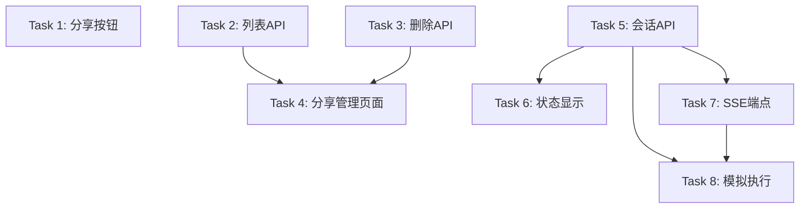

# Task Plan for January 6, 2025

## Overview

根据MVP分析，我们已经完成了Phase 1-3的所有功能。现在需要专注于：
1. **Story 2**: AI文档编辑功能（Phase 4 - 核心MVP功能）
2. **Story 3**: 完善文档分享功能（Phase 5 - 仅剩UI部分）

## 现状分析

### ✅ 已完成
- 所有基础设施（YJS、Blob、认证）
- 所有CLI开发工具（pull/push）
- Web界面基础（项目管理、文件浏览器、文档查看器）
- 分享API端点和公开查看页面
- watch-claude命令（CLI侧）

### ❌ MVP关键缺失
**Story 2 - AI文档编辑**（验收标准）：
- ❌ Chat界面实际功能（UI存在但无功能）
- ❌ 实时执行状态指示器
- ❌ Claude修改时的实时文档更新
- ❌ E2B容器运行时集成

**Story 3 - 文档分享**（验收标准）：
- ❌ 文档查看器中的"分享"按钮
- ❌ 分享管理界面

## 8个独立子任务

### Task 1: 分享按钮UI集成
**类型**: 前端UI  
**耗时**: 1小时  
**MVP贡献**: Story 3 - 完成分享功能的最后一块

#### 实现内容：
1. 在 `/turbo/apps/web/app/projects/[id]/page.tsx` 添加分享按钮
2. 点击调用现有的 POST `/api/share` 端点
3. 使用 `navigator.clipboard.writeText()` 复制链接
4. 显示"已复制"的临时提示

#### 修改文件：
- `/turbo/apps/web/app/projects/[id]/page.tsx`

---

### Task 2: 分享管理列表API
**类型**: 后端API  
**耗时**: 45分钟  
**MVP贡献**: Story 3 - 支持分享管理

#### 实现内容：
1. 创建 GET `/api/share/list` 端点
2. 查询当前用户的所有share_links
3. 返回项目名称、分享时间、访问次数
4. 按创建时间倒序排列

#### 创建文件：
- `/turbo/apps/web/app/api/share/list/route.ts`

---

### Task 3: 撤销分享API
**类型**: 后端API  
**耗时**: 45分钟  
**MVP贡献**: Story 3 - 分享管理功能

#### 实现内容：
1. 创建 DELETE `/api/share/[id]` 端点
2. 验证用户拥有该分享
3. 从share_links表删除记录
4. 返回成功/失败状态

#### 创建文件：
- `/turbo/apps/web/app/api/share/[id]/route.ts`

---

### Task 4: 分享管理页面
**类型**: 前端页面  
**耗时**: 1.5小时  
**MVP贡献**: Story 3 - 完整的分享管理

#### 实现内容：
1. 创建 `/settings/shares` 页面
2. 调用Task 2的列表API
3. 显示分享列表（表格形式）
4. 每行添加删除按钮（调用Task 3的API）
5. 删除前显示确认对话框

#### 创建文件：
- `/turbo/apps/web/app/settings/shares/page.tsx`

---

### Task 5: Claude会话状态API
**类型**: 后端API  
**耗时**: 1小时  
**MVP贡献**: Story 2 - 执行状态跟踪基础

#### 实现内容：
1. 创建 POST `/api/claude/sessions` 创建会话
2. 创建 PATCH `/api/claude/sessions/[id]` 更新状态
3. 使用现有agent_sessions表
4. 状态：pending → running → completed/failed
5. 记录开始/结束时间

#### 创建文件：
- `/turbo/apps/web/app/api/claude/sessions/route.ts`
- `/turbo/apps/web/app/api/claude/sessions/[id]/route.ts`

---

### Task 6: 聊天UI状态显示
**类型**: 前端UI  
**耗时**: 1小时  
**MVP贡献**: Story 2 - 实时执行状态指示器

#### 实现内容：
1. 在聊天输入框下方添加状态栏
2. 显示：🔄 运行中... / ✅ 已完成 / ❌ 失败
3. 运行时显示耗时（秒数）
4. 轮询Task 5的会话状态API

#### 修改文件：
- `/turbo/apps/web/app/projects/[id]/page.tsx`

---

### Task 7: SSE实时更新端点
**类型**: 后端API  
**耗时**: 1.5小时  
**MVP贡献**: Story 2 - 实时更新基础设施

#### 实现内容：
1. 创建 GET `/api/claude/stream/[sessionId]` SSE端点
2. 发送状态更新事件（status_update）
3. 发送文档变更事件（document_change）
4. 心跳保持连接（每30秒）
5. 使用Next.js的流式响应

#### 创建文件：
- `/turbo/apps/web/app/api/claude/stream/[sessionId]/route.ts`

---

### Task 8: 模拟Claude执行端点
**类型**: 后端API  
**耗时**: 1.5小时  
**MVP贡献**: Story 2 - 测试完整流程

#### 实现内容：
1. 创建 POST `/api/claude/execute` 端点
2. 创建会话记录（调用Task 5）
3. 模拟执行：延迟3秒后返回成功
4. 通过SSE发送状态更新
5. 模拟一个文档修改（更新YJS文档）

#### 创建文件：
- `/turbo/apps/web/app/api/claude/execute/route.ts`

#### 说明：
这是模拟端点，但使用真实的会话管理和SSE，为后续E2B集成打好基础。

---

## 任务依赖关系

## 优先级

### 第一批（独立任务）：
- Task 1: 分享按钮（1小时）
- Task 2: 列表API（45分钟）
- Task 3: 删除API（45分钟）
- Task 5: 会话API（1小时）

### 第二批（依赖第一批）：
- Task 4: 分享管理页面（1.5小时）
- Task 6: 状态显示（1小时）
- Task 7: SSE端点（1.5小时）

### 第三批（集成测试）：
- Task 8: 模拟执行（1.5小时）

## 成功标准

1. **Story 3完成**：用户可以在文档查看器分享文档，并在设置页管理分享
2. **Story 2基础完成**：聊天界面可以提交请求，显示执行状态，接收实时更新
3. 所有代码通过lint和类型检查
4. 遵循YAGNI原则，不过度设计

## 下一步计划（20250907）

完成这8个任务后，下一步将是：
1. 集成真实的E2B容器运行时
2. 集成真实的Claude API
3. 实现文档实时同步更新
4. 添加错误处理和重试机制