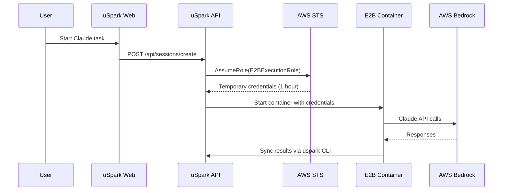

# AWS Bedrock Integration Technical Specification

## Overview

This document defines the technical architecture for integrating AWS Bedrock with uSpark to enable Claude API access within E2B containers. The integration will provide secure, temporary AWS credentials for Claude Code execution in isolated environments.

## Background

### Current State
- uSpark uses E2B containers for executing Claude Code
- Claude Code needs API access to generate and modify project documents
- Currently listed as a Phase 4 requirement in MVP but not implemented
- No existing AWS infrastructure or authentication mechanism

### Problem Statement
E2B containers need secure access to Claude API (via AWS Bedrock) without:
- Exposing long-lived AWS credentials
- Allowing containers to access resources outside their scope
- Creating security vulnerabilities through credential leakage

## Technical Architecture

### Components

#### 1. AWS Bedrock Setup
```
AWS Account
  ├── Bedrock Service
  │   ├── Claude 3.5 Sonnet Model
  │   └── Claude 3.5 Opus Model
  ├── IAM Roles
  │   ├── E2BExecutionRole (for containers)
  │   └── STSProviderRole (for token generation)
  └── STS Service
      └── AssumeRole API
```

#### 2. Token Generation Flow



### Implementation Details

#### 1. Environment Variables

**Production Environment** (Vercel):
```env
# AWS Configuration
AWS_REGION=us-east-1
AWS_ACCOUNT_ID=<account-id>
AWS_ACCESS_KEY_ID=<service-account-key>
AWS_SECRET_ACCESS_KEY=<service-account-secret>

# Bedrock Configuration
BEDROCK_MODEL_ID=anthropic.claude-3-5-sonnet-20241022
BEDROCK_MAX_TOKENS=4096
BEDROCK_TEMPERATURE=0.7

# STS Configuration
STS_ROLE_ARN=arn:aws:iam::<account-id>:role/E2BExecutionRole
STS_SESSION_DURATION=3600  # 1 hour
```

**E2B Container Environment**:
```env
# Injected by uSpark API
AWS_ACCESS_KEY_ID=<temporary-key>
AWS_SECRET_ACCESS_KEY=<temporary-secret>
AWS_SESSION_TOKEN=<session-token>
AWS_REGION=us-east-1

# Bedrock endpoint
BEDROCK_ENDPOINT=https://bedrock-runtime.us-east-1.amazonaws.com
```

#### 2. IAM Role Configuration

**E2BExecutionRole** (assumed by containers):
```json
{
  "Version": "2012-10-17",
  "Statement": [
    {
      "Effect": "Allow",
      "Action": [
        "bedrock:InvokeModel",
        "bedrock:InvokeModelWithResponseStream"
      ],
      "Resource": [
        "arn:aws:bedrock:us-east-1::foundation-model/anthropic.claude-3-5-sonnet*",
        "arn:aws:bedrock:us-east-1::foundation-model/anthropic.claude-3-5-opus*"
      ]
    }
  ]
}
```

**Trust Policy** for E2BExecutionRole:
```json
{
  "Version": "2012-10-17",
  "Statement": [
    {
      "Effect": "Allow",
      "Principal": {
        "AWS": "arn:aws:iam::<account-id>:user/uspark-service"
      },
      "Action": "sts:AssumeRole",
      "Condition": {
        "StringEquals": {
          "sts:ExternalId": "${EXTERNAL_ID}"
        }
      }
    }
  ]
}
```

#### 3. API Implementation

**New API Endpoint**: `/api/bedrock/sts-token`

```typescript
// apps/web/src/app/api/bedrock/sts-token/route.ts
import { STSClient, AssumeRoleCommand } from "@aws-sdk/client-sts";
import { NextResponse } from "next/server";
import { auth } from "@clerk/nextjs/server";

export async function POST(request: Request) {
  const { userId } = await auth();
  if (!userId) {
    return NextResponse.json({ error: "Unauthorized" }, { status: 401 });
  }

  const { sessionId, projectId } = await request.json();

  // Validate session belongs to user
  const session = await db.query.sessions.findFirst({
    where: and(
      eq(sessions.id, sessionId),
      eq(sessions.userId, userId),
      eq(sessions.projectId, projectId)
    )
  });

  if (!session) {
    return NextResponse.json({ error: "Invalid session" }, { status: 403 });
  }

  const stsClient = new STSClient({
    region: process.env.AWS_REGION,
    credentials: {
      accessKeyId: process.env.AWS_ACCESS_KEY_ID!,
      secretAccessKey: process.env.AWS_SECRET_ACCESS_KEY!
    }
  });

  const assumeRoleCommand = new AssumeRoleCommand({
    RoleArn: process.env.STS_ROLE_ARN,
    RoleSessionName: `uspark-e2b-${sessionId}`,
    DurationSeconds: 3600, // 1 hour
    ExternalId: process.env.STS_EXTERNAL_ID,
    Tags: [
      { Key: "UserId", Value: userId },
      { Key: "SessionId", Value: sessionId },
      { Key: "ProjectId", Value: projectId }
    ]
  });

  try {
    const { Credentials } = await stsClient.send(assumeRoleCommand);

    // Log token generation for audit
    await db.insert(auditLogs).values({
      userId,
      action: "sts_token_generated",
      resourceType: "session",
      resourceId: sessionId,
      metadata: {
        projectId,
        expiresAt: Credentials?.Expiration?.toISOString()
      }
    });

    return NextResponse.json({
      credentials: {
        accessKeyId: Credentials?.AccessKeyId,
        secretAccessKey: Credentials?.SecretAccessKey,
        sessionToken: Credentials?.SessionToken,
        expiration: Credentials?.Expiration
      }
    });
  } catch (error) {
    console.error("STS token generation failed:", error);
    return NextResponse.json(
      { error: "Failed to generate credentials" },
      { status: 500 }
    );
  }
}
```

#### 4. E2B Container Integration

**Container Initialization Script**:
```bash
#!/bin/bash
# /setup/init-aws.sh

# Validate AWS credentials are present
if [ -z "$AWS_ACCESS_KEY_ID" ] || [ -z "$AWS_SECRET_ACCESS_KEY" ] || [ -z "$AWS_SESSION_TOKEN" ]; then
    echo "Error: AWS credentials not provided"
    exit 1
fi

# Configure AWS CLI
aws configure set aws_access_key_id "$AWS_ACCESS_KEY_ID"
aws configure set aws_secret_access_key "$AWS_SECRET_ACCESS_KEY"
aws configure set aws_session_token "$AWS_SESSION_TOKEN"
aws configure set region "$AWS_REGION"

# Test Bedrock access
aws bedrock-runtime invoke-model \
  --model-id anthropic.claude-3-5-sonnet-20241022 \
  --body '{"prompt": "Human: Hello\\n\\nAssistant:", "max_tokens": 10}' \
  --cli-binary-format raw-in-base64-out \
  /tmp/test-response.json

if [ $? -eq 0 ]; then
    echo "AWS Bedrock connection successful"
else
    echo "Warning: AWS Bedrock connection test failed"
fi
```

**E2B Dockerfile Update**:
```dockerfile
FROM anthropic/claude-code:latest

# Install AWS CLI
RUN curl "https://awscli.amazonaws.com/awscli-exe-linux-x86_64.zip" -o "awscliv2.zip" && \
    unzip awscliv2.zip && \
    ./aws/install && \
    rm -rf awscliv2.zip aws/

# Install AWS SDK for Node.js
RUN npm install -g @aws-sdk/client-bedrock-runtime

# Copy initialization script
COPY setup/init-aws.sh /setup/init-aws.sh
RUN chmod +x /setup/init-aws.sh

# Run initialization on container start
ENTRYPOINT ["/bin/bash", "-c", "/setup/init-aws.sh && exec $@", "--"]
```

#### 5. Claude Code Configuration

**Claude Code Settings** in E2B:
```json
{
  "claude": {
    "provider": "bedrock",
    "model": "anthropic.claude-3-5-sonnet-20241022",
    "maxTokens": 4096,
    "temperature": 0.7,
    "region": "us-east-1"
  }
}
```

### Security Considerations

#### 1. Credential Rotation
- STS tokens expire after 1 hour
- New tokens generated for each session
- No reuse of expired tokens

#### 2. Least Privilege Access
- Containers only access Bedrock, nothing else
- Scoped to specific Claude models
- No AWS console or management access

#### 3. Audit Logging
- All token generations logged
- Session tracking with user/project IDs
- Expiration timestamps recorded

#### 4. Network Isolation
- E2B containers in isolated network
- Only outbound HTTPS to Bedrock allowed
- No inter-container communication

#### 5. Secret Management
- Service account credentials in Vercel env vars
- External ID for additional security
- No credentials in code or containers

### Error Handling

#### Token Generation Failures
```typescript
enum TokenError {
  INVALID_SESSION = "Session not found or expired",
  UNAUTHORIZED = "User not authorized for this session",
  AWS_ERROR = "AWS service temporarily unavailable",
  RATE_LIMIT = "Token generation rate limit exceeded"
}
```

#### Retry Strategy
- Exponential backoff for AWS API failures
- Maximum 3 retries with 1s, 2s, 4s delays
- User notification on permanent failure

### Monitoring & Observability

#### Metrics to Track
1. **Token Generation**
   - Success/failure rate
   - Generation latency
   - Tokens per user/project

2. **Bedrock Usage**
   - API calls per session
   - Token consumption
   - Model invocation errors

3. **Security Events**
   - Failed authentication attempts
   - Expired token usage
   - Anomalous access patterns

#### Logging
```typescript
// Structured logging format
{
  "timestamp": "2025-01-18T10:30:00Z",
  "level": "INFO",
  "service": "bedrock-integration",
  "event": "token_generated",
  "userId": "user_123",
  "sessionId": "session_456",
  "projectId": "project_789",
  "duration": 234,
  "success": true
}
```

### Implementation Phases

#### Phase 1: Basic Integration (Week 1)
- [ ] AWS account setup
- [ ] IAM roles creation
- [ ] Basic STS token generation API
- [ ] Manual testing with curl

#### Phase 2: E2B Integration (Week 2)
- [ ] Update E2B Dockerfile
- [ ] Container initialization scripts
- [ ] Environment variable injection
- [ ] Integration testing

#### Phase 3: Production Hardening (Week 3)
- [ ] Error handling & retries
- [ ] Audit logging
- [ ] Monitoring setup
- [ ] Security review

#### Phase 4: Optimization (Week 4)
- [ ] Token caching (where safe)
- [ ] Connection pooling
- [ ] Performance tuning
- [ ] Load testing

### Testing Strategy

#### Unit Tests
```typescript
describe("STS Token Generation", () => {
  it("should generate token for valid session", async () => {
    // Mock AWS STS client
    // Test token generation
    // Verify audit log
  });

  it("should reject invalid session", async () => {
    // Test authorization
  });

  it("should handle AWS errors gracefully", async () => {
    // Test error scenarios
  });
});
```

#### Integration Tests
- Test full flow from API to AWS
- Verify token expiration
- Test container initialization
- Validate Bedrock API calls

#### Security Tests
- Penetration testing for credential leaks
- Token expiration validation
- Cross-session access attempts
- Rate limiting verification

### Cost Estimation

#### AWS Costs (Monthly)
- **Bedrock API**: $0.003 per 1K input tokens, $0.015 per 1K output tokens
  - Estimated: 10M tokens/month = ~$150
- **STS API**: Free (included in AWS Free Tier)
- **CloudWatch Logs**: ~$5/month

#### Total Estimated Cost
- Development: ~$50/month
- Production: ~$200-300/month (depending on usage)

### Risks & Mitigations

| Risk | Impact | Likelihood | Mitigation |
|------|--------|------------|------------|
| AWS Service Outage | High | Low | Implement fallback to direct API keys with alerts |
| Token Theft | High | Low | 1-hour expiration, audit logging, network isolation |
| Rate Limiting | Medium | Medium | Implement token caching, request queuing |
| Cost Overrun | Medium | Medium | Usage monitoring, spending alerts, quotas |
| E2B Container Failure | High | Medium | Health checks, auto-restart, error reporting |

### Dependencies

#### External Services
- AWS Bedrock (Claude API)
- AWS STS (Token generation)
- AWS IAM (Role management)
- E2B Platform (Container runtime)

#### Internal Components
- Session management system
- Audit logging infrastructure
- Authentication (Clerk)
- Project/user validation

### Migration Plan

Since this is a new feature, no migration needed. However:

1. **Environment Setup**
   - Add AWS credentials to Vercel
   - Configure IAM roles
   - Update E2B container image

2. **Gradual Rollout**
   - Internal testing first
   - Beta users second
   - Full production last

3. **Rollback Plan**
   - Feature flag to disable Bedrock
   - Fallback to direct API keys
   - Quick revert capability

### Documentation Requirements

#### Developer Documentation
- API endpoint specifications
- Environment setup guide
- Troubleshooting guide
- Security best practices

#### User Documentation
- Feature availability notice
- Usage limits explanation
- Error message glossary
- Support contact info

### Success Metrics

#### Technical Metrics
- Token generation success rate > 99.9%
- Average token generation time < 500ms
- Zero security incidents
- Container startup time < 10s

#### Business Metrics
- Claude task completion rate > 95%
- User satisfaction score > 4.5/5
- Support ticket reduction by 30%
- Cost per session < $0.10

### Open Questions

1. **Multi-Region Support**
   - Should we deploy to multiple AWS regions?
   - How to handle region failover?

2. **Token Caching**
   - Can we safely cache tokens for multiple requests?
   - What's the optimal cache duration?

3. **Model Selection**
   - Should users choose between Sonnet and Opus?
   - How to handle model-specific pricing?

4. **Rate Limiting**
   - What are appropriate rate limits per user?
   - How to handle burst traffic?

5. **Compliance**
   - Are there regulatory requirements for AI usage?
   - Data residency considerations?

### Next Steps

1. **Immediate Actions**
   - Review and approve this specification
   - Create AWS account and setup IAM
   - Start Phase 1 implementation

2. **Stakeholder Alignment**
   - Review with security team
   - Confirm budget with finance
   - Align with product roadmap

3. **Technical Preparation**
   - Set up development AWS account
   - Create testing framework
   - Prepare monitoring dashboard

---

*Created: 2025-01-18*
*Status: Draft - Pending Review*
*Owner: Engineering Team*
*Reviewers: CTO, Security Lead, DevOps Lead*