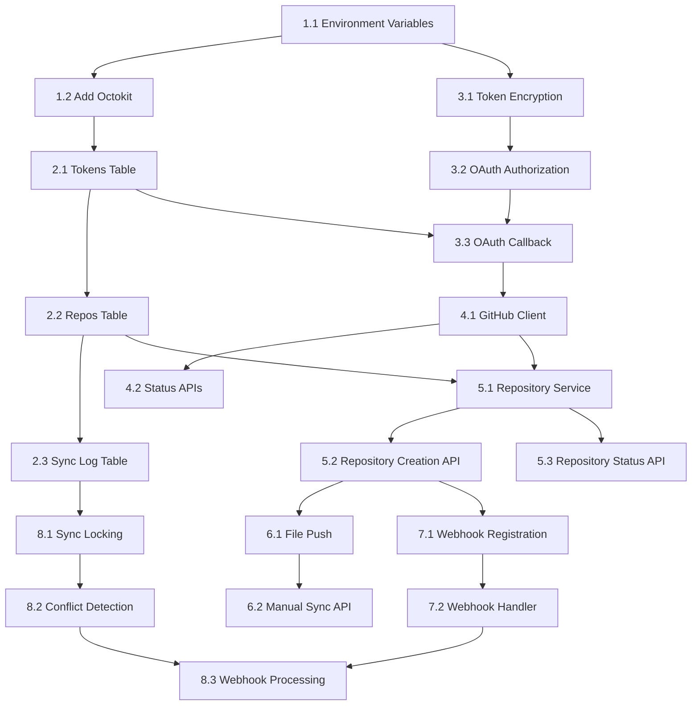

# GitHub Integration Implementation Plan

## Overview

This document outlines the step-by-step implementation of GitHub integration for uSpark. The integration will allow users to sync their uSpark documents with GitHub repositories through a custom OAuth flow.

## Core Requirements

Based on the spec in `user_story_developer_local_sync.md`, we need:
- GitHub OAuth authorization with repo permissions
- Automatic creation of dedicated docs repositories
- Bidirectional sync (Web ↔ GitHub)
- Conflict prevention with optimistic locking
- Full git workflow support (clone, pull, push)

## Implementation Strategy: Baby Steps

### Phase 1: Foundation & Configuration

#### Task 1.1: Environment Variables Setup
- **Goal**: Add GitHub-related environment variables
- **Files**: `apps/web/src/env.ts`
- **Changes**:
  - Add `GITHUB_CLIENT_ID` (optional)
  - Add `GITHUB_CLIENT_SECRET` (optional)
  - Add `GITHUB_WEBHOOK_SECRET` (optional)
  - Add `ENCRYPTION_KEY` (32-char string, optional)
- **Testing**: Ensure env validation passes
- **PR Size**: ~10 lines

#### Task 1.2: Add Octokit Dependency
- **Goal**: Add GitHub API client dependency
- **Files**: `apps/web/package.json`
- **Changes**:
  - Add `@octokit/rest` to dependencies
  - Update lockfile
- **Testing**: Ensure dependency installs correctly
- **PR Size**: ~5 lines

### Phase 2: Database Schema

#### Task 2.1: GitHub Tokens Table
- **Goal**: Create database table for storing encrypted GitHub tokens
- **Files**: 
  - `apps/web/src/db/schema/github-tokens.ts`
  - `apps/web/src/db/db.ts`
- **Changes**:
  - Create `github_tokens` table with user_id, encrypted_access_token, scope, etc.
  - Add to schema exports
- **Testing**: Verify table creation in migration
- **PR Size**: ~30 lines

#### Task 2.2: GitHub Repositories Table
- **Goal**: Create table for tracking linked repositories
- **Files**: Extend `apps/web/src/db/schema/github-tokens.ts`
- **Changes**:
  - Add `github_repos` table with project_id, repo_name, repo_id, webhook_id
  - Add indexes
- **Testing**: Verify table creation and relationships
- **PR Size**: ~20 lines

#### Task 2.3: Sync Log Table
- **Goal**: Create table for tracking sync operations
- **Files**: Extend `apps/web/src/db/schema/github-tokens.ts`
- **Changes**:
  - Add `github_sync_log` table for audit trail
  - Track direction (push/pull), status, commit_sha, errors
- **Testing**: Verify table creation
- **PR Size**: ~15 lines

### Phase 3: Authentication & Authorization

#### Task 3.1: Token Encryption Service
- **Goal**: Create secure token encryption/decryption utilities
- **Files**: `apps/web/src/lib/crypto.ts`
- **Changes**:
  - Implement AES-256-GCM encryption functions
  - Add token generation utilities
  - Add webhook signature verification (for later use)
- **Testing**: Unit tests for encrypt/decrypt roundtrip
- **PR Size**: ~60 lines

#### Task 3.2: Basic OAuth Flow - Authorization
- **Goal**: Create GitHub OAuth authorization endpoint
- **Files**: `apps/web/app/api/auth/github/route.ts`
- **Changes**:
  - Create GET endpoint for GitHub OAuth redirect
  - Generate secure state parameter
  - Request appropriate scopes (repo, write:repo_hook)
- **Testing**: Verify redirect URL construction
- **PR Size**: ~40 lines

#### Task 3.3: Basic OAuth Flow - Callback
- **Goal**: Handle GitHub OAuth callback and store token
- **Files**: `apps/web/app/api/auth/github/callback/route.ts`
- **Changes**:
  - Exchange code for access token
  - Fetch GitHub user info
  - Encrypt and store token in database
  - Handle error cases
- **Testing**: Mock GitHub API responses, verify token storage
- **PR Size**: ~80 lines

### Phase 4: GitHub API Integration

#### Task 4.1: GitHub Client Service
- **Goal**: Create authenticated GitHub API client
- **Files**: `apps/web/src/lib/github/client.ts`
- **Changes**:
  - Create function to get authenticated Octokit client
  - Add connection status checks
  - Add disconnect functionality
- **Testing**: Mock database calls, verify Octokit initialization
- **PR Size**: ~50 lines

#### Task 4.2: User GitHub Status API
- **Goal**: Create API endpoints for GitHub connection status
- **Files**: 
  - `apps/web/app/api/github/status/route.ts`
  - `apps/web/app/api/github/disconnect/route.ts`
- **Changes**:
  - GET endpoint for connection status
  - POST endpoint for disconnecting GitHub
- **Testing**: Verify status responses, test disconnect flow
- **PR Size**: ~40 lines

### Phase 5: Repository Management

#### Task 5.1: Repository Creation Service
- **Goal**: Create service to create GitHub repositories
- **Files**: `apps/web/src/lib/github/repository.ts`
- **Changes**:
  - Implement createGitHubRepository function
  - Auto-initialize with README
  - Store repository info in database
- **Testing**: Mock GitHub API calls, verify database storage
- **PR Size**: ~70 lines

#### Task 5.2: Repository Creation API
- **Goal**: Create API endpoint for repository creation
- **Files**: `apps/web/app/api/projects/[projectId]/github/create/route.ts`
- **Changes**:
  - POST endpoint to create repository for project
  - Validate GitHub connection exists
  - Return repository URLs
- **Testing**: Test repository creation flow
- **PR Size**: ~50 lines

#### Task 5.3: Repository Status API
- **Goal**: Create API endpoint for project GitHub status
- **Files**: `apps/web/app/api/projects/[projectId]/github/status/route.ts`
- **Changes**:
  - GET endpoint for project GitHub connection status
  - Return repository info if connected
- **Testing**: Verify status responses
- **PR Size**: ~30 lines

### Phase 6: Basic File Operations

#### Task 6.1: Simple File Push
- **Goal**: Implement basic file pushing to GitHub
- **Files**: Extend `apps/web/src/lib/github/repository.ts`
- **Changes**:
  - Add pushToGitHub function
  - Create blobs, tree, and commit
  - Update repository references
- **Testing**: Mock GitHub API, verify commit creation
- **PR Size**: ~80 lines

#### Task 6.2: Manual Sync API
- **Goal**: Create API endpoint for manual sync
- **Files**: `apps/web/app/api/projects/[projectId]/github/sync/route.ts`
- **Changes**:
  - POST endpoint to trigger manual sync
  - Push sample/test files to repository
- **Testing**: Verify sync operation
- **PR Size**: ~40 lines

### Phase 7: Webhook Infrastructure

#### Task 7.1: Webhook Registration
- **Goal**: Add webhook creation during repository setup
- **Files**: Extend `apps/web/src/lib/github/repository.ts`
- **Changes**:
  - Create webhook during repository creation
  - Generate and store webhook secret
  - Configure for push events
- **Testing**: Mock webhook creation API calls
- **PR Size**: ~40 lines

#### Task 7.2: Basic Webhook Handler
- **Goal**: Create webhook endpoint to receive GitHub events
- **Files**: `apps/web/app/api/webhooks/github/route.ts`
- **Changes**:
  - POST endpoint for webhook events
  - Verify webhook signatures
  - Log incoming events (no processing yet)
- **Testing**: Test signature verification, event logging
- **PR Size**: ~60 lines

### Phase 8: Sync Logic

#### Task 8.1: Sync Locking Mechanism
- **Goal**: Implement distributed locking for sync operations
- **Files**: `apps/web/src/lib/github/sync.ts`
- **Changes**:
  - In-memory lock management
  - Lock acquisition and release functions
  - Timeout handling
- **Testing**: Test lock behavior, timeout scenarios
- **PR Size**: ~50 lines

#### Task 8.2: Conflict Detection
- **Goal**: Add conflict detection before sync operations
- **Files**: Extend `apps/web/src/lib/github/sync.ts`
- **Changes**:
  - Check for remote changes before allowing edits
  - Sync status tracking
  - Error handling for conflicts
- **Testing**: Test conflict scenarios
- **PR Size**: ~60 lines

#### Task 8.3: Webhook Processing
- **Goal**: Process incoming webhook events
- **Files**: Extend `apps/web/app/api/webhooks/github/route.ts`
- **Changes**:
  - Parse push events
  - Log sync operations
  - Basic file change tracking
- **Testing**: Test webhook processing with mock events
- **PR Size**: ~50 lines

### Phase 9: User Interface (Future)

#### Task 9.1: GitHub Connection Component
- **Goal**: Create UI for connecting GitHub account
- **Files**: `apps/web/src/components/github-connection.tsx`
- **Changes**: React component for GitHub connection status and actions
- **Testing**: Component testing
- **PR Size**: ~100 lines

#### Task 9.2: Project GitHub Settings
- **Goal**: Create project-level GitHub integration UI
- **Files**: `apps/web/src/components/project-github-sync.tsx`  
- **Changes**: Repository creation, sync status, manual sync
- **Testing**: Component testing
- **PR Size**: ~120 lines

## Implementation Guidelines

### General Principles
1. **One task per PR** - Each task should be a separate, reviewable PR
2. **Tests required** - Every task must include appropriate tests
3. **Error handling** - Implement proper error handling and user feedback
4. **Type safety** - Maintain strict TypeScript compliance
5. **Security** - Always encrypt tokens, verify webhook signatures

### Testing Strategy
- **Unit tests** for utility functions and services
- **Integration tests** for API endpoints
- **Mock external APIs** (GitHub API calls)
- **Database tests** for schema operations

### Rollback Strategy
- Each task is small enough to be easily reverted
- Database migrations should be reversible
- Feature flags for incomplete flows

## Dependencies Between Tasks

## Success Criteria

Each phase completion should achieve:

**Phase 1-2**: GitHub OAuth flow works end-to-end
**Phase 3-4**: Users can connect/disconnect GitHub accounts
**Phase 5**: Users can create repositories for projects  
**Phase 6**: Basic file sync works (Web → GitHub)
**Phase 7-8**: Webhook receiving and basic processing works
**Phase 9**: Complete UI for GitHub integration

## Risk Mitigation

1. **API Rate Limits**: Implement proper error handling and retry logic
2. **Token Security**: Always encrypt tokens at rest, use secure key management
3. **Webhook Security**: Always verify signatures, handle replay attacks
4. **Database Performance**: Add proper indexes, monitor query performance
5. **User Experience**: Provide clear error messages and loading states

## Future Enhancements (Out of Scope)

- Multiple repository support per project
- Branch-specific syncing
- Merge conflict resolution UI  
- GitHub Actions integration
- Repository templates
- Automated sync scheduling