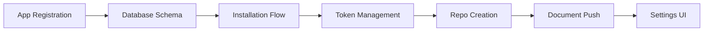

# GitHub Integration MVP Implementation Plan

## GitHub App Integration Flow

### User Journey
1. User clicks "Connect GitHub" in uSpark settings
2. Redirected to `github.com/apps/uspark-app/installations/new`
3. Selects personal account or organization
4. Chooses repository access (all or selected repositories)
5. Clicks "Install" button
6. Returns to uSpark with installation complete

### Why GitHub App (not OAuth)
- **Installation-based**: Users install once, manage repository access from GitHub
- **Installation Token**: Backend can operate without user present
- **Fine-grained permissions**: Per-repository access control
- **Built-in webhooks**: Automatic webhook configuration on install
- **Organization friendly**: Admins can approve/manage centrally

## Core MVP Requirements

The MVP focuses on one-way synchronization from Web to GitHub:
1. **Install GitHub App** - One-click GitHub App installation ✅
2. **Select existing repository** - Choose from user's existing repos ❌ (currently creates new repo)
3. **Web → GitHub sync to `/spec` directory** - Manual push to existing repo's `/spec` path ❌ (currently mirrors to dedicated repo)
4. **UI feedback** - Show sync status and prevent duplicate clicks via UI ✅

**Current Implementation Status**:
- ✅ GitHub App installation works correctly
- ❌ Creates dedicated `uspark-{project.id}` repo (should select existing repo)
- ❌ Full project mirror (should sync to `/spec` directory only)
- ✅ Sync button and UI feedback works

**Out of Scope for MVP:**
- GitHub → Web synchronization (future enhancement)
- Automatic sync on every edit (manual sync only)
- Conflict resolution (one-way sync avoids conflicts)

## GitHub App Configuration

### Required Permissions
- **Repository permissions**:
  - Contents: Read & Write (for pushing documents)
  - Metadata: Read (always required)
  
### Webhook Events
- **Installation**: When app is installed/uninstalled
- **Installation repositories**: When repos are added/removed
- **Push**: Reserved for future GitHub → Web sync (post-MVP, not implemented)

### Task 1: GitHub App Registration & Dependencies ✅ COMPLETED
- **Goal**: Register GitHub App and add Octokit SDK
- **GitHub App Settings**:
  - Name: `uSpark Sync`
  - Callback URL: `https://uspark.ai/api/github/callback`
  - Setup URL: `https://uspark.ai/api/github/setup`
  - Webhook URL: `https://uspark.ai/api/github/webhook`
  - Permissions: `contents: write`, `metadata: read`
- **Code Changes**:
  - Add `GITHUB_APP_ID`, `GITHUB_APP_PRIVATE_KEY`, `GITHUB_WEBHOOK_SECRET` to env.ts
  - Add `@octokit/app` and `@octokit/webhooks` to package.json
- **MVP Value**: Foundation for GitHub App integration
- **PR Size**: ~25 lines

### Task 2: Database Schema ✅ COMPLETED
- **Goal**: Create tables for GitHub App installations and repositories
- **Files**: `apps/web/src/db/schema/github.ts`, `apps/web/src/db/db.ts`
- **Changes**:
  - `github_installations` table (user_id, installation_id, account_name)
  - `github_repos` table (project_id, repo_name, repo_id, installation_id)
  - Add to schema exports
- **MVP Value**: Store GitHub App installations and repo links
- **PR Size**: ~50 lines

### Task 3: Installation & Setup Flow ✅ COMPLETED
- **Goal**: Handle GitHub App installation callbacks
- **Files**: 
  - `apps/web/app/api/github/install/route.ts` - Redirect to GitHub
  - `apps/web/app/api/github/setup/route.ts` - Handle post-installation
  - `apps/web/app/api/github/webhook/route.ts` - Process GitHub events
- **Setup Handler Logic**:
  ```typescript
  // Handle different installation states
  ?setup_action=install&installation_id=123 // Immediate install
  ?setup_action=request // Needs org admin approval
  ?setup_action=update // Permissions updated
  ```
- **Webhook Signature Verification**:
  ```typescript
  import crypto from 'crypto';
  
  function verifyWebhookSignature(payload: string, signature: string) {
    const expectedSig = `sha256=${crypto
      .createHmac('sha256', process.env.GITHUB_WEBHOOK_SECRET!)
      .update(payload)
      .digest('hex')}`;
    return signature === expectedSig;
  }
  ```
- **MVP Value**: Complete installation flow with org approval support
- **PR Size**: ~120 lines

### Task 4: Installation Token Management ✅ COMPLETED
- **Goal**: Create GitHub App client with installation tokens
- **Files**:
  - `apps/web/src/lib/github/app.ts` - App client factory
  - `apps/web/app/api/github/installations/route.ts` - List user installations
  - `apps/web/app/api/projects/[projectId]/github/link/route.ts` - Link project to installation
- **Key Implementation**:
  ```typescript
  // Get installation-specific Octokit client
  const app = new App({ appId, privateKey });  
  const octokit = await app.getInstallationOctokit(installationId);
  ```
- **MVP Value**: Backend can act on behalf of installation
- **PR Size**: ~100 lines

### Task 5: Repository Creation ✅ COMPLETED
- **Goal**: Create GitHub repositories for projects
- **Files**:
  - `apps/web/src/lib/github/repository.ts` - Repository operations
  - `apps/web/app/api/projects/[projectId]/github/repository/route.ts` - Create/get repo
- **Repository Creation Logic**:
  ```typescript
  // Create repository using installation token
  await octokit.rest.repos.createForAuthenticatedUser({
    name: `uspark-${projectId}`,
    private: true,
    auto_init: true,
    description: `uSpark sync repository for project ${projectId}`
  });
  ```
- **MVP Value**: Auto-create `uspark-{project.id}` repositories
- **PR Size**: ~100 lines

### Task 6: Document → GitHub Push ✅ COMPLETED
- **Goal**: Push documents to GitHub using Git Trees API
- **Files**:
  - `apps/web/src/lib/github/sync.ts` - Sync operations
  - `apps/web/app/api/projects/[projectId]/github/push/route.ts` - Push endpoint
- **Git Trees API Flow**:
  ```typescript
  // 1. Get current commit SHA
  const { data: ref } = await octokit.rest.git.getRef(...);
  
  // 2. Create blobs for each file
  const blob = await octokit.rest.git.createBlob(...);
  
  // 3. Create tree with all files
  const tree = await octokit.rest.git.createTree(...);
  
  // 4. Create commit
  const commit = await octokit.rest.git.createCommit(...);
  
  // 5. Update reference
  await octokit.rest.git.updateRef(...);
  ```
- **MVP Value**: Push all project documents to GitHub
- **PR Size**: ~150 lines

### Task 7: Settings UI Component ✅ COMPLETED
- **Goal**: GitHub integration UI in settings page
- **Files**: 
  - `apps/web/src/components/settings/github-connection.tsx`
  - Update settings page to include component
- **UI States**:
  ```typescript
  // Not connected
  <Button onClick={installGitHubApp}>Connect GitHub</Button>
  
  // Connected
  <div>
    <Badge>Connected to {installationAccount}</Badge>
    <Button variant="outline">Manage on GitHub</Button>
  </div>
  
  // Project-level
  <Button onClick={createRepository}>
    Create Repository (uspark-{projectId})
  </Button>
  ```
- **MVP Value**: Complete UI for GitHub App management
- **PR Size**: ~100 lines

## Implementation Order



### Milestones
- **After Task 3**: Users can install GitHub App
- **After Task 5**: Projects can have GitHub repositories  
- **After Task 6**: Documents sync to GitHub
- **After Task 7**: Complete MVP with settings UI

## MVP Success Criteria

✅ **MVP Complete (All Tasks Done)**: Users can:
- Install GitHub App via setup flow
- Auto-create repositories named `uspark-{project.id}`
- Manually sync documents from web to GitHub using sync button
- View sync status feedback in UI
- Manage GitHub connection through settings page
- Connect/disconnect GitHub account
- View installation status and account details

## Implementation Guidelines

### Security
- **Webhook signature verification** - Always validate `x-hub-signature-256`
- **Private key storage** - Store GitHub App private key securely (base64 encoded in env)
- **Installation validation** - Verify installation belongs to authenticated user

### Testing
- **Mock Octokit** - Use `@octokit/rest` mocks for unit tests
- **Webhook testing** - Use GitHub webhook test payloads
- **E2E skip** - Skip GitHub integration in E2E tests (use feature flags)

### Error Handling
- **Installation states** - Handle pending approval, suspension, deletion
- **Rate limits** - Implement exponential backoff for GitHub API
- **Sync conflicts** - Clear user messaging when push fails

## Future Enhancements (Post-MVP)

- **GitHub → Web sync** - Bidirectional synchronization using webhooks
- **Automatic sync** - Auto-push on every document save
- **Conflict resolution** - Handle concurrent edits from multiple sources
- **Branch management** - Support for feature branches and PRs
- **Multiple repository support** - Link multiple repos per project
- **Sync history** - Track and display sync history with rollback