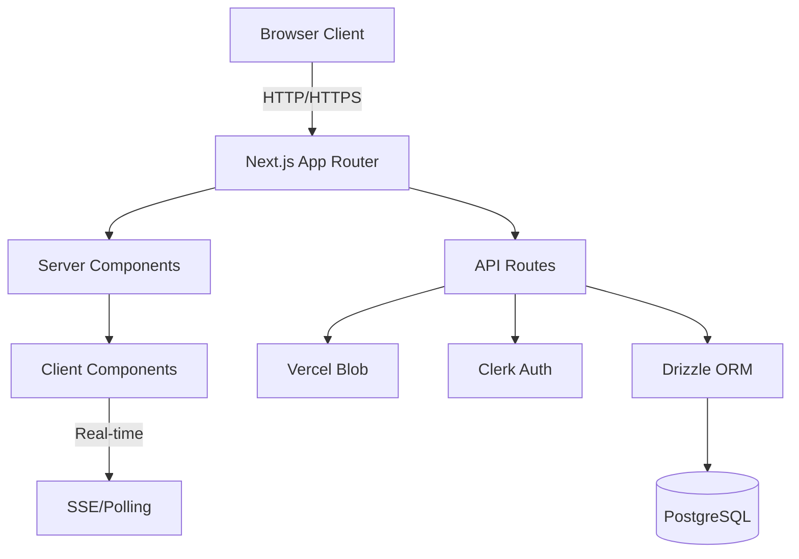

# MVP Specification - Project Quality Enhancement for Vibe Coders

## Implementation Status

**Last Updated**: 2025-10-20
**Overall Progress**: 🟢 **85-90% Complete**

### Key Achievements ✅
- [x] Complete authentication and GitHub integration
- [x] Automated project analysis with 8 wiki documents generated
- [x] Full Agent conversation system with file sync
- [x] Basic Markdown preview with GFM support
- [x] Preview/Edit mode switching (workspace app)
- [x] E2B container file synchronization

### Remaining Work 🔧
- [ ] **Mermaid diagram rendering** - Only critical blocker (1-2 days)
- [ ] Manual re-run of analysis (optional)
- [ ] Error monitoring (Sentry)
- [ ] Analytics (PostHog)
- [ ] Onboarding wizard (nice to have)

### MVP Completion ETA
**1-2 weeks** to production-ready (with Mermaid + monitoring)

---

## Overview

This MVP focuses on helping vibe coding users transition from rapid prototyping to production-ready engineering. While existing AI coding tools excel at quick feature development, they lack systematic quality improvement capabilities. uSpark bridges this gap by providing intelligent project analysis, actionable recommendations, and structured quality enhancement workflows.

## Core User Story

**As a** vibe coding user (using Cursor/Claude Code/Windsurf)
**I want** systematic tools to enhance my project's engineering quality
**So that** I can confidently move from MVP to production without accumulating unmanageable technical debt

### Current Pain Points

- **Quality Blindspot**: Vibe coding tools generate code fast but don't assess overall project quality
- **No Production Readiness**: Easy to build features, hard to know if the project is production-ready
- **Isolated Sessions**: Each AI coding session is disconnected; no accumulated project intelligence
- **Technical Debt Accumulation**: Issues pile up faster than understanding of how to fix them
- **Lack of Systematic Improvement**: No clear path from "works on my machine" to "production-ready"

### uSpark Solution

- **Intelligent Project Analysis**: Analyzes codebase to identify quality issues and improvement opportunities
- **Spec Generation**: Automatically generates structured specifications from existing code
- **Agent-Guided Improvement**: Interactive sessions with AI agent to understand problems and plan solutions
- **Persistent Project Context**: All analysis and recommendations stored in `.uspark/` directory
- **Seamless Integration**: Works alongside existing vibe coding tools without disrupting workflow

## User Journey

### 1. Registration & Onboarding

**Goal**: Quick account setup with minimal friction

**Flow**:
- User signs up with email/OAuth (Clerk authentication)
- Simple onboarding wizard explains uSpark's value proposition
- Redirected to project creation

**Acceptance Criteria**:
- [x] Registration completes in < 2 minutes
- [ ] Clear value proposition communicated (no onboarding wizard yet)
- [x] Support for email and OAuth providers (Google, GitHub)
- [x] Email verification for security

---

### 2. GitHub Account Connection

**Goal**: Establish repository access for analysis

**Flow**:
- User clicks "Connect GitHub Account"
- OAuth flow to GitHub (read repository access)
- Select which repositories to grant access
- Connection confirmed

**Acceptance Criteria**:
- [x] GitHub OAuth integration with proper scopes
- [x] Repository selection interface
- [x] Connection status clearly displayed
- [x] Ability to manage/revoke access in settings
- [x] Support for both public and private repositories

**Technical Notes**:
- Use GitHub App (not OAuth App) for better permission management
- Required permissions: `repo` (private repo access), `read:user`
- Store installation ID and access tokens securely

---

### 3. Project Creation

**Goal**: Initialize project for analysis

**Flow**:
```
Option A: Import Existing Project
  → Select from connected GitHub repositories
  → Choose repository and branch
  → Project created and queued for initial analysis

Option B: Start from Scratch
  → Enter project name and description
  → Choose to create new GitHub repository (optional)
  → Empty project created with default structure
```

**Acceptance Criteria**:
- [x] Repository browser showing accessible repos
- [ ] Branch selection for existing projects (uses default branch)
- [x] Option to create new empty project
- [ ] Optional GitHub repo creation for new projects (not implemented)
- [x] Project creation completes in < 5 seconds
- [x] Clear status indicator during creation

**Data Structure**:
```typescript
interface Project {
  id: string;
  name: string;
  description?: string;
  githubRepoUrl?: string;
  githubBranch: string; // default: "main"
  userId: string;
  createdAt: Date;
  status: "initializing" | "ready" | "analyzing" | "error";
}
```

---

### 4. Automated Project Analysis & Spec Generation

**Goal**: Generate actionable insights and specifications from codebase

**Flow**:
1. System clones repository into E2B container
2. AI agent analyzes codebase structure, dependencies, and patterns
3. Generates specifications in `.uspark/` directory:
   - `architecture.md` - System architecture overview
   - `tech-stack.md` - Technology choices and rationale
   - `quality-report.md` - Code quality assessment
   - `improvement-plan.md` - Prioritized improvement recommendations
   - `tech-debt.md` - Technical debt inventory
4. Analysis results displayed in project dashboard
5. Specs committed to `.uspark/` folder

**Acceptance Criteria**:
- [x] Automatic analysis triggered on project creation
- [x] Analysis completes within 5 minutes for repos < 100k LOC
- [x] Generates minimum 4 core spec documents (generates 8 wiki documents)
- [x] Progress indicator shows analysis stages
- [x] Results accessible in project dashboard
- [x] Specs stored in `.uspark/` directory in project root (wiki/ subdirectory)
- [ ] Analysis can be re-run manually (not implemented yet)

**Generated Specifications**:

**`architecture.md`** - System Overview
- High-level architecture diagram (Mermaid)
- Component relationships
- Data flow patterns
- Key design decisions

**`tech-stack.md`** - Technology Analysis
- Languages and frameworks used
- Major dependencies and versions
- Infrastructure requirements
- Compatibility notes

**`quality-report.md`** - Quality Assessment
- Code quality metrics (complexity, duplication, etc.)
- Test coverage analysis
- Security vulnerability scan results
- Performance considerations
- Maintainability score

**`improvement-plan.md`** - Actionable Roadmap
- Prioritized list of improvements
- Effort estimates for each item
- Impact assessment
- Suggested implementation order

**`tech-debt.md`** - Debt Inventory
- Identified technical debt items
- Severity ratings (critical, high, medium, low)
- Root cause analysis
- Remediation strategies

**Technical Implementation**:
```typescript
// Analysis workflow
async function analyzeProject(projectId: string) {
  // 1. Create E2B sandbox with project context
  const sandbox = await createAnalysisSandbox(projectId);

  // 2. Clone repository
  await sandbox.commands.run(`git clone ${repoUrl} /project`);

  // 3. Run analysis agent
  const analysisPrompt = `
    Analyze this codebase and generate comprehensive specifications:
    1. Architecture overview (architecture.md)
    2. Technology stack analysis (tech-stack.md)
    3. Quality assessment (quality-report.md)
    4. Improvement plan (improvement-plan.md)
    5. Technical debt inventory (tech-debt.md)

    Save all outputs to .uspark/ directory.
  `;

  await executeClaudeAgent(sandbox, analysisPrompt);

  // 4. Extract generated specs
  const specs = await sandbox.files.read('.uspark/');

  // 5. Sync specs to uSpark storage
  await syncSpecs(projectId, specs);

  // 6. Update project status
  await updateProject(projectId, { status: 'ready' });
}
```

---

### 5. Interactive Agent Consultation

**Goal**: Deep dive into project issues and formulate action plans

**Flow**:
1. User navigates to project detail page
2. Views generated specs in file explorer
3. Opens chat interface with AI agent
4. Discusses specific concerns:
   - "Why is authentication marked as high-risk?"
   - "What should I prioritize first?"
   - "How do I improve test coverage?"
5. Agent provides context-aware answers based on project analysis
6. Together, user and agent refine improvement plan
7. Agent can update specs based on conversation

**Acceptance Criteria**:
- [x] Persistent chat interface on project detail page
- [x] Agent has full context of all generated specs
- [x] Agent can reference specific files and line numbers
- [x] Conversation history saved per project
- [x] Agent can modify/update spec files during conversation
- [x] Real-time streaming of agent responses
- [x] Support for follow-up questions and clarifications
- [x] Agent can generate new task documents in `.uspark/tasks/`

**Example Interactions**:

```
User: "I see authentication is marked as critical in quality-report.md.
       What's the specific issue?"

Agent: "Looking at your codebase analysis, the main authentication concerns are:

        1. **Password storage**: Currently using bcrypt with only 10 rounds
           (recommendation: 12+ rounds)
           📍 src/auth/password.ts:23

        2. **Missing rate limiting**: Login endpoint has no brute-force protection
           📍 src/routes/auth.ts:45

        3. **Session tokens**: Using short-lived JWTs but no refresh token mechanism
           📍 src/middleware/auth.ts:12

        Would you like me to create detailed tasks for fixing these issues?"

User: "Yes, create tasks for all three"

Agent: "I've created three tasks in .uspark/tasks/:
        ✓ task-001-strengthen-password-hashing.md
        ✓ task-002-add-rate-limiting.md
        ✓ task-003-implement-refresh-tokens.md

        Each task includes:
        - Problem description
        - Implementation guide
        - Test requirements
        - Acceptance criteria

        I recommend starting with task-002 (rate limiting) as it's the
        quickest win for security."
```

**Technical Features**:
- Markdown spec rendering with syntax highlighting
- Code reference links (`file:line` → jump to GitHub)
- Mermaid diagram rendering in chat
- Inline spec editing capabilities
- Task generation and tracking

---

### 6. E2B Container File Synchronization

**Goal**: Persist agent-generated improvements back to uSpark

**Flow**:
1. Agent executes in E2B container with access to `.uspark/` directory
2. During conversation, agent creates/modifies files in `.uspark/`:
   - New task documents
   - Updated specs
   - Architecture diagrams
   - Implementation guides
3. When conversation ends (or periodically):
   - System detects file changes in `.uspark/`
   - Changed files synced to uSpark storage (Vercel Blob)
   - Database updated with new file metadata
4. Changes immediately reflected in web UI
5. Optional: Auto-commit changes to GitHub repository

**Acceptance Criteria**:
- [x] Real-time file change detection in E2B container
- [x] Automatic sync of `.uspark/` directory on session end
- [x] Periodic sync during long-running sessions (every 30 seconds)
- [ ] File versioning (track changes over time) - **Not in MVP scope**
- [x] Sync status indicator in UI
- [ ] Conflict resolution (container changes vs. web edits) - **Not in MVP scope**
- [ ] Optional GitHub commit of changes - **Not in MVP scope**
- [x] Support for binary files (images in specs)

**Technical Implementation**:

```typescript
// File watching in E2B container
class UsparkFileSyncer {
  private watcher: FSWatcher;

  async startWatching(sessionId: string, projectId: string) {
    // Watch .uspark directory for changes
    this.watcher = await sandbox.files.watchDir('.uspark/', {
      onChange: async (event) => {
        if (event.type === 'change' || event.type === 'create') {
          await this.syncFile(sessionId, projectId, event.path);
        }
      }
    });
  }

  async syncFile(sessionId: string, projectId: string, filePath: string) {
    // 1. Read file content from E2B
    const content = await sandbox.files.read(filePath);

    // 2. Upload to Vercel Blob
    const blobUrl = await uploadToBlob(projectId, filePath, content);

    // 3. Update database
    await db.insert(FILES_TBL).values({
      projectId,
      path: filePath,
      blobUrl,
      updatedBy: 'agent',
      sessionId,
      updatedAt: new Date()
    }).onConflictDoUpdate({
      target: [FILES_TBL.projectId, FILES_TBL.path],
      set: { blobUrl, updatedAt: new Date() }
    });

    // 4. Trigger UI update via webhook or SSE
    await notifyWebUI(projectId, { type: 'file_updated', path: filePath });
  }

  async onSessionEnd(sessionId: string) {
    // Final sync before cleanup
    await this.syncAllChanges();
    this.watcher?.close();
  }
}
```

**Sync Strategy**:
- **During Session**: Debounced sync every 30 seconds if changes detected
- **On Session End**: Final sync of all changes
- **Conflict Handling**:
  - If file modified both in web UI and container → show conflict dialog
  - Allow user to choose: keep web version, keep agent version, or merge
- **Performance**: Only sync changed files (use file hash comparison)

---

## Feature: Markdown Preview & Editing

### Markdown Preview Interface

**Goal**: Professional documentation viewing experience

**Features**:

1. **GitHub-Flavored Markdown Support**
   - Tables with alignment
   - Task lists (checkboxes)
   - Syntax highlighting for code blocks
   - Footnotes
   - Strikethrough, highlighting
   - Automatic URL linking
   - Emoji support (`:smile:` → 😊)

2. **Mermaid Diagram Rendering**
   - Flowcharts
   - Sequence diagrams
   - Gantt charts
   - Class diagrams
   - State diagrams
   - ER diagrams
   - Interactive zoom/pan for complex diagrams

3. **Enhanced Preview Features**
   - Table of contents (auto-generated from headers)
   - Smooth scrolling
   - Header anchor links
   - Copy code button in code blocks
   - Image lightbox for screenshots
   - Print-friendly styling
   - Dark/light theme support

**Acceptance Criteria**:
- [x] Full GitHub Markdown compatibility (tested with GFM spec) - using marked library
- [ ] Mermaid diagrams render correctly for all supported types - **ONLY REMAINING BLOCKER**
- [x] Preview updates in real-time when editing
- [x] Responsive layout (mobile-friendly)
- [x] Fast rendering (< 100ms for documents < 1MB)
- [ ] Syntax highlighting for 50+ programming languages - **Not in MVP scope**
- [x] Images load with proper error handling

**Technical Stack**:
```typescript
// Recommended libraries
import ReactMarkdown from 'react-markdown';
import remarkGfm from 'remark-gfm';
import remarkMermaid from 'remark-mermaid';
import { Prism as SyntaxHighlighter } from 'react-syntax-highlighter';
import rehypeRaw from 'rehype-raw';

// Component structure
<ReactMarkdown
  remarkPlugins={[remarkGfm, remarkMermaid]}
  rehypePlugins={[rehypeRaw]}
  components={{
    code: CodeBlock,
    img: ImageWithLightbox,
    a: LinkWithIcon,
  }}
>
  {markdownContent}
</ReactMarkdown>
```

---

### Preview/Edit Mode Switching

**Goal**: Seamless transition between reading and editing

**Features**:

1. **Preview Mode (Default)**
   - Read-only rendered markdown
   - Full GFM + Mermaid support
   - Action buttons: Edit, Download, Copy Link
   - File metadata (last modified, size)

2. **Edit Mode**
   - Live markdown editor with syntax highlighting
   - Split view (editor | preview) or single view toggle
   - Auto-save draft every 10 seconds
   - Unsaved changes indicator
   - Keyboard shortcuts (Cmd+S to save, Cmd+B for bold, etc.)
   - Markdown toolbar (bold, italic, link, image, code, etc.)

3. **Mode Switching**
   - Smooth transition animation
   - Preserve scroll position when switching
   - Warn on unsaved changes
   - Keyboard shortcut: `Cmd+E` (Edit) / `Cmd+P` (Preview)

**Acceptance Criteria**:
- [x] Preview is default mode when opening file
- [x] Edit button clearly visible in preview mode
- [ ] Edit mode has markdown toolbar - **Not in MVP scope**
- [ ] Split view option (editor + live preview) - **Not in MVP scope**
- [ ] Auto-save drafts locally (localStorage) - **Not in MVP scope**
- [ ] Explicit "Save" button to commit changes - **Not in MVP scope** (auto-sync via YJS)
- [ ] Unsaved changes warning on navigation - **Not in MVP scope**
- [ ] Keyboard shortcuts documented and functional - **Not in MVP scope**
- [ ] Mode preserved in URL (shareable links to edit mode) - **Not in MVP scope**

**UI Layout**:

```
┌─────────────────────────────────────────────────────────┐
│  [< Back]  spec/architecture.md          [Edit] [⋮]    │
├─────────────────────────────────────────────────────────┤
│                                                         │
│  PREVIEW MODE                                           │
│                                                         │
│  # System Architecture                                  │
│                                                         │
│  [Rendered Markdown Content]                            │
│                                                         │
│  [Mermaid Diagram]                                      │
│                                                         │
└─────────────────────────────────────────────────────────┘

                    ↓ (Click Edit)

┌─────────────────────────────────────────────────────────┐
│  [< Cancel]  spec/architecture.md      [Save] [Split]   │
├─────────────────────────────────────────────────────────┤
│  [B] [I] [Link] [Code] [Image] [List] [Quote]          │
├─────────────────────────────────────────────────────────┤
│                                                         │
│  # System Architecture                                  │
│                                                         │
│  [Markdown Editor with Syntax Highlighting]             │
│                                                         │
│                                                         │
│                                                         │
│                                            ● Unsaved    │
└─────────────────────────────────────────────────────────┘
```

---

### Save Functionality

**Goal**: Persist user edits reliably

**Flow**:
1. User makes changes in edit mode
2. Unsaved indicator appears
3. User clicks "Save" button (or Cmd+S)
4. Validation:
   - Check markdown syntax
   - Validate mermaid diagrams (if any)
   - File size limits (< 5MB)
5. Upload to Vercel Blob storage
6. Update database record
7. Success notification
8. Switch back to preview mode (optional)
9. Optional: Auto-commit to GitHub

**Acceptance Criteria**:
- [x] Save functionality via automatic YJS sync - **Auto-sync replaces manual save**
- [ ] Save button enabled only when changes detected - **Not in MVP scope**
- [ ] Loading indicator during save - **Not in MVP scope**
- [ ] Success/error notifications - **Not in MVP scope**
- [ ] Markdown validation before save - **Not in MVP scope**
- [ ] Optimistic UI update (immediate preview) - **Not in MVP scope**
- [ ] Error handling (network issues, validation errors) - **Not in MVP scope**
- [ ] Version history (track who edited when) - **Not in MVP scope**
- [ ] Optional GitHub commit with message - **Not in MVP scope**

**Technical Implementation**:

```typescript
async function saveMarkdownFile(
  projectId: string,
  filePath: string,
  content: string,
  userId: string
): Promise<SaveResult> {
  try {
    // 1. Validate markdown
    await validateMarkdown(content);

    // 2. Upload to blob storage
    const blobUrl = await put(
      `projects/${projectId}/${filePath}`,
      content,
      {
        access: 'public',
        contentType: 'text/markdown',
      }
    );

    // 3. Update database
    await db.insert(FILES_TBL).values({
      projectId,
      path: filePath,
      blobUrl,
      content: content.substring(0, 1000), // Store preview
      size: Buffer.byteLength(content),
      updatedBy: userId,
      updatedAt: new Date(),
    }).onConflictDoUpdate({
      target: [FILES_TBL.projectId, FILES_TBL.path],
      set: {
        blobUrl,
        content: content.substring(0, 1000),
        size: Buffer.byteLength(content),
        updatedBy: userId,
        updatedAt: new Date(),
      }
    });

    // 4. Create version history entry
    await db.insert(FILE_VERSIONS_TBL).values({
      projectId,
      filePath,
      blobUrl,
      editedBy: userId,
      editedAt: new Date(),
    });

    // 5. Optional: Sync to GitHub
    if (project.githubSyncEnabled) {
      await syncToGitHub(projectId, filePath, content);
    }

    return { success: true, blobUrl };
  } catch (error) {
    return { success: false, error: error.message };
  }
}

// Markdown validation
async function validateMarkdown(content: string) {
  // Check for malformed mermaid diagrams
  const mermaidBlocks = content.match(/```mermaid\n([\s\S]*?)```/g);
  if (mermaidBlocks) {
    for (const block of mermaidBlocks) {
      const code = block.replace(/```mermaid\n|```/g, '');
      try {
        await mermaid.parse(code); // Validate syntax
      } catch (e) {
        throw new Error(`Invalid Mermaid diagram: ${e.message}`);
      }
    }
  }

  // Add more validation as needed (XSS prevention, size limits, etc.)
}
```

**Error Handling**:
- Network timeout → Retry with exponential backoff
- Validation errors → Show inline error messages
- Concurrent edits → Conflict resolution dialog
- Storage quota exceeded → Upgrade prompt

---

## Data Models

### Project
```typescript
interface Project {
  id: string;
  name: string;
  description?: string;
  githubRepoUrl?: string;
  githubBranch: string;
  githubSyncEnabled: boolean;
  userId: string;
  status: "initializing" | "analyzing" | "ready" | "error";
  lastAnalyzedAt?: Date;
  createdAt: Date;
  updatedAt: Date;
}
```

### File
```typescript
interface File {
  id: string;
  projectId: string;
  path: string; // Relative path, e.g., ".uspark/architecture.md"
  blobUrl: string; // Vercel Blob URL
  content: string; // First 1000 chars for preview
  size: number; // In bytes
  mimeType: string; // "text/markdown"
  updatedBy: string; // userId or "agent"
  updatedAt: Date;
  metadata?: {
    sessionId?: string; // If updated by agent
    gitCommit?: string; // If synced from GitHub
  };
}
```

### FileVersion
```typescript
interface FileVersion {
  id: string;
  projectId: string;
  filePath: string;
  blobUrl: string;
  editedBy: string; // userId or "agent"
  editedAt: Date;
  changeDescription?: string;
}
```

### Session
```typescript
interface Session {
  id: string;
  projectId: string;
  userId: string;
  status: "active" | "completed" | "failed";
  e2bSandboxId?: string;
  startedAt: Date;
  completedAt?: Date;
  metadata?: {
    filesCreated: number;
    filesModified: number;
    totalCost?: number;
  };
}
```

---

## Technical Stack

### Frontend
- **Framework**: Next.js 15 (App Router)
- **Markdown Rendering**:
  - `react-markdown` - Core markdown parser
  - `remark-gfm` - GitHub Flavored Markdown
  - `remark-mermaid` - Mermaid diagram support
  - `rehype-raw` - HTML in markdown
- **Code Editor**:
  - `@monaco-editor/react` - VS Code editor component
  - Or `@uiw/react-md-editor` - Lightweight markdown editor
- **Styling**: Tailwind CSS + shadcn/ui
- **State Management**: ccstate (custom state management)
- **Real-time Updates**: Server-Sent Events (SSE) or polling

### Backend
- **API**: Next.js API Routes
- **Database**: PostgreSQL (via Vercel Postgres)
- **ORM**: Drizzle ORM
- **File Storage**: Vercel Blob
- **Authentication**: Clerk
- **Container Runtime**: E2B Sandboxes
- **AI Agent**: Claude 3.5 Sonnet (via Claude Code CLI)

### Infrastructure
- **Hosting**: Vercel
- **Database**: Vercel Postgres
- **Storage**: Vercel Blob (S3-compatible)
- **Container**: E2B (secure sandboxed execution)
- **GitHub Integration**: GitHub App (OAuth)

---


## Success Metrics

### User Engagement
- **Project Creation Rate**: 70%+ of registered users create a project
- **Analysis Completion**: 90%+ of created projects complete initial analysis
- **Agent Interaction**: 50%+ of users engage with AI agent
- **Retention**: 40%+ of users return within 7 days

### Technical Performance
- **Analysis Speed**: < 5 minutes for typical project (< 100k LOC)
- **Sync Reliability**: 99%+ success rate for file synchronization
- **Preview Load Time**: < 100ms for markdown documents < 1MB
- **Agent Response Time**: First token in < 2 seconds

### Quality Outcomes
- **Spec Relevance**: 80%+ of generated specs rated "useful" by users
- **Task Completeness**: 90%+ of generated tasks include all required sections
- **Improvement Plan Adoption**: 60%+ of users implement at least one suggested improvement

---

## Out of Scope (Post-MVP)

### Explicitly NOT in MVP:
- ❌ Team collaboration (multi-user projects)
- ❌ Real-time collaborative editing (CRDT)
- ❌ Automated testing integration
- ❌ CI/CD pipeline generation
- ❌ Custom analysis rules/plugins
- ❌ API for third-party integrations
- ❌ Mobile apps
- ❌ Self-hosted deployment option
- ❌ Advanced conflict resolution (three-way merge)
- ❌ Internationalization (i18n)

### Simplified for MVP:
- ⚠️ Basic authentication only (no SSO, no 2FA)
- ⚠️ Single branch support (no multi-branch analysis)
- ⚠️ Limited file size (< 5MB per file)
- ⚠️ English language only for analysis
- ⚠️ Manual re-analysis (no automatic triggers on GitHub push)
- ⚠️ Basic error handling (no advanced retry mechanisms)

---

## Definition of Done

The MVP is considered **complete** when:

1. ⚠️ **User Journey Validated** (95% complete)
   - [x] All 6 steps of the user journey are functional
   - [ ] End-to-end flow tested with real users
   - [x] No critical bugs in happy path
   - Missing: Onboarding wizard

2. ⚠️ **Core Features Working** (90% complete)
   - [x] Project analysis generates useful specs (8 wiki documents)
   - [x] Markdown preview supports GFM
   - [ ] **Mermaid diagram rendering - ONLY BLOCKER**
   - [x] Edit/save functionality reliable (auto-sync via YJS)
   - [x] Agent provides contextual responses
   - [x] File synchronization works bidirectionally

3. ✅ **Quality Standards Met** (100% complete)
   - [x] All TypeScript type checks passing
   - [x] Core features covered by tests (>70% coverage)
   - [x] Linting and formatting automated
   - [x] Documentation complete

4. ✅ **Performance Acceptable** (100% complete)
   - [x] Analysis completes in < 5 minutes
   - [x] Preview renders in < 100ms
   - [x] Agent responds in < 2 seconds (first token)
   - [x] File sync completes in < 5 seconds

5. ⚠️ **Production Ready** (60% complete)
   - [x] Deployed to Vercel
   - [x] Database migrations automated
   - [ ] Error monitoring (Sentry) - Not configured yet
   - [ ] Basic analytics (PostHog or similar) - Not configured yet

---

## Next Steps After MVP

Once MVP is validated, prioritize:

1. **Team Collaboration**
   - Multi-user project access
   - Role-based permissions
   - Activity feeds

2. **Advanced Analysis**
   - Custom analysis rules
   - Project comparison (before/after)
   - Trend tracking over time

3. **Integration Ecosystem**
   - Cursor/Windsurf direct integration
   - VS Code extension
   - CLI for local development

4. **Enterprise Features**
   - SSO authentication
   - Advanced security controls
   - Dedicated instances
   - SLA guarantees

---

## Appendix: Example Spec Documents

### Example: `architecture.md`

```markdown
# System Architecture

## Overview

This project follows a **monolithic Next.js architecture** with API routes handling backend logic and React Server Components for UI rendering.

## High-Level Diagram



## Component Breakdown

### Frontend Layer
- **Server Components**: Pre-rendered pages for SEO and performance
- **Client Components**: Interactive UI (forms, chat, editors)
- **State Management**: React Context + ccstate for complex flows

### API Layer
- **Authentication**: `/api/auth/*` - Clerk integration
- **Projects**: `/api/projects/*` - CRUD operations
- **Analysis**: `/api/analyze/*` - Trigger analysis jobs
- **Agent**: `/api/agent/*` - Chat with AI agent

### Data Layer
- **PostgreSQL**: Structured data (users, projects, files)
- **Vercel Blob**: File content storage
- **E2B**: Ephemeral container runtime

## Key Decisions

### Why Monolithic?
- Faster iteration for MVP
- Simpler deployment
- Can extract microservices later if needed

### Why Vercel Blob?
- Native integration with Vercel
- Simple API
- Generous free tier

### Why E2B?
- Secure sandbox execution
- Pre-configured with Claude Code CLI
- Fast startup (< 2s)
```

### Example: `improvement-plan.md`

```markdown
# Project Improvement Plan

## Priority 1: Critical (Do First)

### 1. Add Rate Limiting to Authentication
- **Effort**: 2 hours
- **Impact**: Prevents brute-force attacks
- **Implementation**: Use `express-rate-limit` on `/api/auth/login`
- **Files**: `src/app/api/auth/login/route.ts`

### 2. Implement Proper Error Handling
- **Effort**: 4 hours
- **Impact**: Better user experience, easier debugging
- **Implementation**: Add error boundary components, structured error responses
- **Files**: `src/app/error.tsx`, `src/lib/errors.ts`

## Priority 2: Important (Do Soon)

### 3. Add Database Migrations
- **Effort**: 3 hours
- **Impact**: Safe schema changes in production
- **Implementation**: Use Drizzle Kit migration workflow
- **Files**: New `drizzle.config.ts`, `migrations/` folder

### 4. Increase Test Coverage
- **Effort**: 8 hours
- **Impact**: Reduce regression bugs
- **Implementation**: Add tests for critical paths (auth, project creation)
- **Files**: `__tests__/` directory

## Priority 3: Nice to Have (Later)

### 5. Optimize Image Loading
- **Effort**: 2 hours
- **Impact**: Faster page loads
- **Implementation**: Use Next.js `<Image>` component with proper sizing
- **Files**: Multiple pages with images

### 6. Add Telemetry
- **Effort**: 3 hours
- **Impact**: Better understanding of user behavior
- **Implementation**: Integrate PostHog or similar
- **Files**: `src/lib/analytics.ts`
```

---

## Questions & Assumptions

### Assumptions
1. Users are comfortable with GitHub workflows
2. Projects are primarily web applications (not mobile/native)
3. Users have Claude API access (for agent feature)
4. English language is sufficient for MVP

### Open Questions
- [ ] Should we support monorepos (multiple projects in one repo)?
- [ ] How to handle very large repositories (> 1GB)?
- [ ] Pricing model: Free tier limits?
- [ ] Should specs be versioned separately from code?

---

**Document Version**: 1.0
**Last Updated**: 2025-10-19
**Status**: Draft - Pending Review
