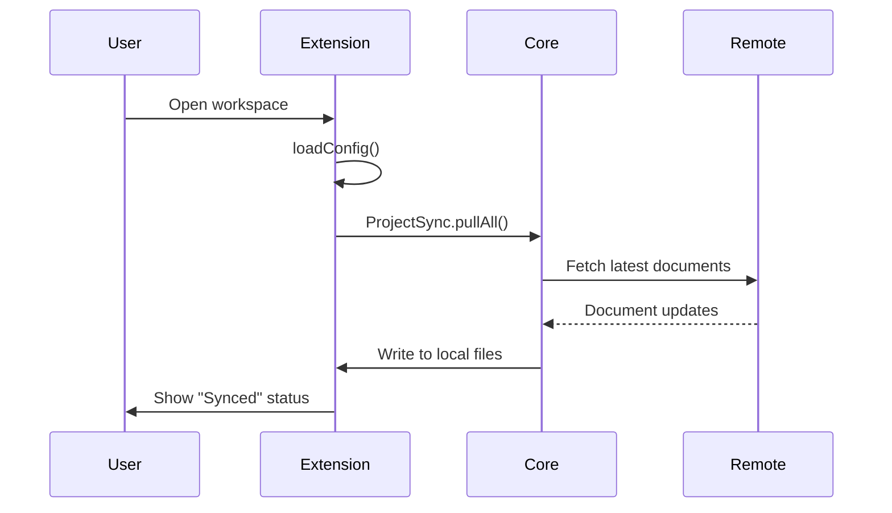
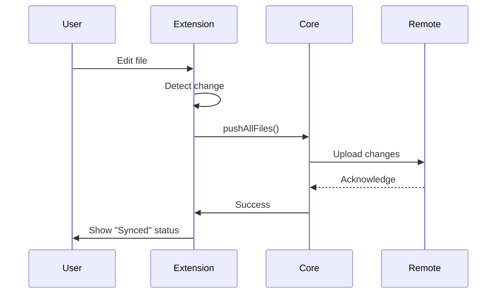

# VSCode Extension Specification

## Overview

uSpark VSCode 扩展旨在为开发者提供无缝的本地-远程文档同步体验，让用户能够在本地 IDE 中直接编辑和查看与 uSpark 项目同步的文档。

## User Story

**作为一个研发用户**，我希望：
- 从 VSCode 应用市场安装 uSpark 插件
- 在已经设置好同步的目录中工作
- 与 uSpark 的项目保持文档自动同步
- 在本地直接编辑文档
- 查看远程同步的文档

**以便于**：
- 使用熟悉的本地编辑器而不是 Web 界面
- 实时看到团队成员的文档更新
- 离线编辑，自动同步到云端
- 保持本地和远程文档的一致性

## Core Features

### 1. 自动安装与配置
- [ ] 从 VSCode Marketplace 发布和安装
- [x] 检测工作区中的 `.uspark.json` 或 `.uspark/.config.json`
- [x] 自动激活扩展

### 2. 双向同步
- [ ] **Pull**: 从远程拉取最新文档到本地
- [ ] **Push**: 将本地更改推送到远程
- [x] 定时自动同步（5分钟间隔）
- [ ] 文件变更监听触发同步
- [ ] 冲突检测与解决

### 3. 状态显示
- [x] 状态栏显示同步状态
  - "$(sync) Auto Sync" - 空闲状态
  - "$(sync~spin) Syncing..." - 同步中
  - "$(check) Synced" - 同步完成
- [ ] 同步历史记录
- [ ] 错误提示和日志

### 4. 用户交互
- [ ] 配置项设置（同步间隔、忽略文件等）
- [ ] 手动触发同步命令
- [ ] 查看同步状态命令
- [ ] 查看冲突和解决冲突

## Technical Architecture

### Directory Structure
```
apps/vscode-extension/
├── src/
│   ├── extension.ts          # 扩展入口，定时同步逻辑
│   ├── config.ts              # 配置加载（.uspark.json / .uspark/.config.json）
│   ├── sync/                  # 同步功能（待实现）
│   │   ├── pull.ts           # 拉取远程文档
│   │   ├── push.ts           # 推送本地更改
│   │   └── conflict.ts       # 冲突处理
│   └── __tests__/            # 单元测试
├── package.json              # 扩展清单
└── tsconfig.json             # TypeScript 配置
```

### Configuration Files

支持两种配置文件路径（优先级从高到低）：

1. **`.uspark.json`** - 项目根目录
```json
{
  "projectId": "project-id",
  "version": "1"
}
```

2. **`.uspark/.config.json`** - .uspark 目录
```json
{
  "projectId": "project-id",
  "version": "1"
}
```

配置加载逻辑：
- 返回 `configDir` 作为同步的工作目录
- 优先使用 `.uspark.json`
- 如果不存在，使用 `.uspark/.config.json`

### Sync Mechanism

#### Pull Flow


#### Push Flow


## Implementation Status

### ✅ Completed (v0.0.1)
- [x] 基础扩展框架
- [x] 配置文件加载（`.uspark.json` / `.uspark/.config.json`）
- [x] 状态栏显示
- [x] 定时同步触发（5分钟）
- [x] 单元测试（4个测试）
- [x] 集成到 turbo monorepo
- [x] CI/CD 流程

### 🚧 In Progress
- [ ] 实际同步逻辑实现
  - [ ] 使用 `@uspark/core` 的 `ProjectSync`
  - [ ] 使用 CLI 的 `pushAllFiles`

### 📋 Planned (v0.1.0)
- [ ] Pull 功能实现
- [ ] Push 功能实现
- [ ] 错误处理和用户提示
- [ ] 冲突检测
- [ ] 同步日志输出

### 📋 Future Enhancements
- [ ] 手动同步命令
- [ ] 配置项设置界面
- [ ] 选择性同步（忽略某些文件）
- [ ] 冲突解决界面
- [ ] 同步历史查看
- [ ] 离线模式支持
- [ ] 发布到 VSCode Marketplace

## Dependencies

### Required Packages
- `@uspark/core` - Core sync functionality
- `@uspark/cli` - File push utilities
- `vscode` - VSCode extension API

### VSCode API Usage
- `workspace.workspaceFolders` - 获取工作区路径
- `window.createStatusBarItem` - 状态栏显示
- `setInterval` - 定时同步

## Testing Strategy

### Unit Tests
- [x] Config loading from `.uspark.json`
- [x] Config loading from `.uspark/.config.json`
- [x] Config priority (`.uspark.json` > `.uspark/.config.json`)
- [x] Config not found scenario
- [ ] Sync pull functionality
- [ ] Sync push functionality
- [ ] Conflict detection

### Integration Tests
- [ ] End-to-end sync workflow
- [ ] Multiple workspace scenarios
- [ ] Error recovery

### Manual Testing
- [ ] Install and activate extension
- [ ] Verify auto-sync behavior
- [ ] Test with real uSpark projects

## Security Considerations

- Configuration files should not contain sensitive tokens
- Authentication should use uSpark's existing auth system
- File paths should be validated to prevent directory traversal
- Sync operations should respect file permissions

## Performance Considerations

- Sync interval: 5 minutes (configurable in future)
- Only sync changed files (delta sync)
- Debounce file change events
- Background sync to avoid blocking UI

## Error Handling

- Network errors: Retry with exponential backoff
- Authentication errors: Prompt user to re-authenticate
- File conflicts: Notify user, provide resolution options
- Configuration errors: Show error message in status bar

## Activation Events

Extension activates when:
- Workspace contains `.uspark.json`
- Workspace contains `.uspark/.config.json`

```json
{
  "activationEvents": [
    "workspaceContains:.uspark.json",
    "workspaceContains:.uspark/.config.json"
  ]
}
```

## Release Plan

### v0.0.1 (Current - Merged)
- Basic framework
- Config loading
- Status bar display
- Timer-based sync trigger (placeholder)

### v0.1.0 (Next)
- Implement actual sync (pull & push)
- Error handling
- Basic conflict detection

### v0.2.0
- Manual sync commands
- Configuration settings
- Conflict resolution UI

### v1.0.0
- Publish to VSCode Marketplace
- Full documentation
- Production-ready sync
- Offline mode support

## Immediate Next Steps

### 1. UX Improvements
**Priority**: High
**Description**: 改进用户体验，优化状态栏和日志输出

**Tasks**:
- [ ] **未登录提示**: 没登录状态下打开窗口，应该右下角提示登录，点击后打开浏览器进行 OAuth 登录
- [ ] **状态栏菜单优化**:
  - [ ] 右下角不展示文字，只显示一个 icon
  - [ ] 点击 icon 后弹出菜单
  - [ ] 已登录状态显示用户名，如 `uSpark (ethan@uspark.ai)`
  - [ ] 菜单项包含 Login / Logout 选项
- [ ] **Output 日志输出**: 确保日志能正确输出到 VSCode 的 Output 面板中，用户可以在 Output 下拉菜单中找到 "uSpark" 频道

**Current Issues**:
- 日志没有出现在 Output 面板中
- 状态栏显示文字而非图标
- 未登录时没有明确的提示引导用户登录

---

### 2. Release Please Configuration
**Priority**: High
**Description**: 配置 release-please 自动发布 VSCode 插件版本

**Tasks**:
- [ ] 在 `.release-please-manifest.json` 中添加 `apps/vscode-extension` 配置
- [ ] 在 `release-please-config.json` 中添加 vscode-extension 包配置
- [ ] 配置自动生成 CHANGELOG.md
- [ ] 确保 package.json 版本自动更新
- [ ] 测试 release-please workflow

**Reference**: 参考 CLI 的 release-please 配置

---

### 2. Development Workflow Integration
**Priority**: High
**Description**: 在 `pnpm dev` 时自动构建 VSCode 插件，与 CLI 保持一致的开发体验

**Tasks**:
- [ ] 在 `apps/vscode-extension/package.json` 中添加 `dev` script
- [ ] 配置 TypeScript watch 模式 (`tsc -watch`)
- [ ] 在根目录 `package.json` 的 `dev` script 中包含 vscode-extension
- [ ] 测试热重载是否正常工作
- [ ] 添加开发文档说明如何在 VSCode 中调试扩展

**Example dev script**:
```json
{
  "scripts": {
    "dev": "tsc -watch -p ./"
  }
}
```

---

### 3. Authentication Flow Design
**Priority**: Critical
**Description**: 设计 VSCode 插件的登录流程，将认证信息存储在 `$HOME/.uspark` 中，与 CLI 保持一致

**Tasks**:
- [ ] **Web 端**: 设计新的登录页面用于 VSCode 设备登录
  - [ ] 创建 `/vscode-auth` 页面（类似 CLI 的 `/cli-auth`）
  - [ ] 实现设备码（device code）授权流程
  - [ ] 显示用户码和确认界面
  - [ ] 生成 VSCode 专用 token

- [ ] **VSCode 插件端**: 实现认证流程
  - [ ] 创建 `src/auth.ts` 模块
  - [ ] 实现 OAuth device flow
    1. 请求 device code 和 user code
    2. 在浏览器中打开授权页面
    3. 轮询检查用户是否授权
    4. 获取 access token
  - [ ] 将 token 存储到 `$HOME/.uspark/config.json`
  - [ ] 实现 token 自动刷新机制
  - [ ] 添加登出功能

- [ ] **配置管理**:
  - [ ] 统一 CLI 和 VSCode 的配置目录结构
  - [ ] 配置文件格式：
    ```
    $HOME/.uspark/
    └── config.json          # 统一配置文件（CLI 和 VSCode 共用）
    ```
  - [ ] 实现配置读写工具函数
  - [ ] 处理权限和安全问题

**API Endpoints** (参考 CLI auth):
- `POST /api/vscode-auth/device` - 生成设备码
- `POST /api/vscode-auth/token` - 轮询获取 token
- `GET /vscode-auth` - 用户授权页面

**Security Considerations**:
- Token 加密存储
- 使用文件权限保护配置文件（chmod 600）
- Token 过期和刷新机制
- 安全的设备码流程

**Reference**:
- CLI auth implementation: `apps/cli/src/auth.ts`
- CLI auth API: `apps/web/app/api/cli/auth/`

---

### 4. Implement Real Sync Functionality
**Priority**: Critical
**Description**: 实现真实的同步逻辑，替换当前的占位实现

**Tasks**:
- [ ] 调研和设计同步方案（方案待定）
- [ ] Pull 功能：从远程拉取文档到本地
- [ ] Push 功能：将本地更改推送到远程
- [ ] 同步状态管理
- [ ] 冲突检测和处理
- [ ] 错误处理和重试机制
- [ ] 单元测试和集成测试

---

## Task Summary

| Task | Priority | Status | PR/Notes | Dependencies |
|------|----------|--------|----------|---------------|
| UX 改进 (状态栏/日志/Multi-root) | High | ✅ **Completed** | [PR #778](https://github.com/uspark-hq/uspark/pull/778) | None |
| Release Please 配置 | High | ✅ **Completed** | Already configured, v0.2.2 released | None |
| 开发工作流集成 | High | ✅ **Completed** | Turbo auto-discovery works | None |
| 认证流程设计 | Critical | ✅ **Completed** | [PR #761](https://github.com/uspark-hq/uspark/pull/761) | None |
| **实现真实同步** | **Critical** | 🔴 **Not Started** | **Next Priority** | Auth flow ✅ |

### Completed Tasks Summary (v0.2.2)

#### 1. ✅ UX Improvements - [PR #778](https://github.com/uspark-hq/uspark/pull/778)
- Created `src/logger.ts` for structured logging to Output channel
- Optimized status bar to show icon only with interactive menu
- Added Login/Logout/Sync Now/Show Logs options in quick menu
- Multi-root workspace support (.code-workspace files)
- All logs with timestamps and levels (INFO, ERROR, WARN, DEBUG)

#### 2. ✅ Development Workflow Integration
- `dev` script in package.json: `tsc -watch -p ./`
- Turbo automatically discovers and runs the dev task
- Verified command: `pnpm dev` runs TypeScript watch mode

#### 3. ✅ Release Please Configuration
- CHANGELOG.md auto-generated ✅
- package.json version auto-updated ✅
- Current version: v0.2.2
- Release workflow functional

#### 4. ✅ Authentication Flow - [PR #761](https://github.com/uspark-hq/uspark/pull/761)
- Web端: `/vscode-auth` page with OAuth flow
- VSCode端: `src/auth.ts` with browser-based authentication
- Token storage in `$HOME/.uspark/config.json`
- File permissions set to 0600 for security

---

### Next Priority: Implement Real Sync Functionality

**Status**: 🔴 Not Started (All prerequisites completed)

**Critical Task**: Replace placeholder sync logic with real implementation (see `src/api.ts:51-56`)


## References

- [VSCode Extension API](https://code.visualstudio.com/api)
- [Publishing Extensions](https://code.visualstudio.com/api/working-with-extensions/publishing-extension)
- [@uspark/core documentation](../packages/core/README.md)
- [PR #749: VSCode Extension Basic Setup](https://github.com/uspark-hq/uspark/pull/749)
