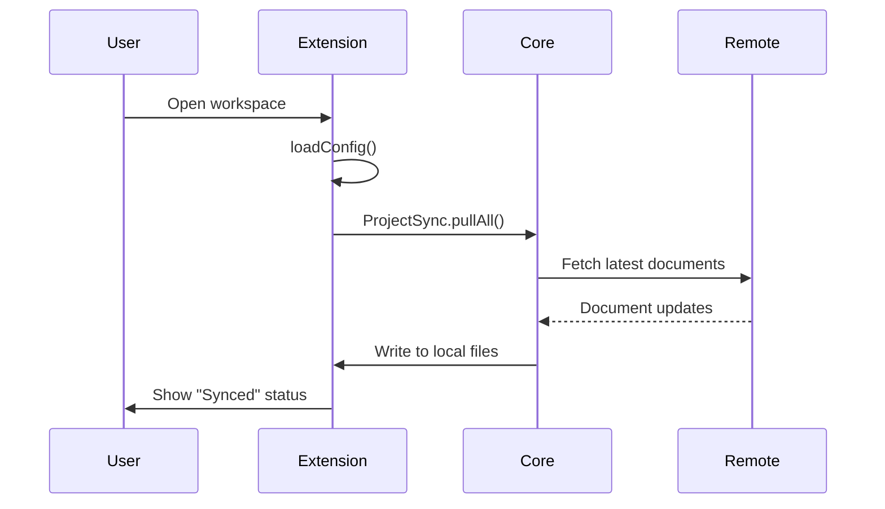
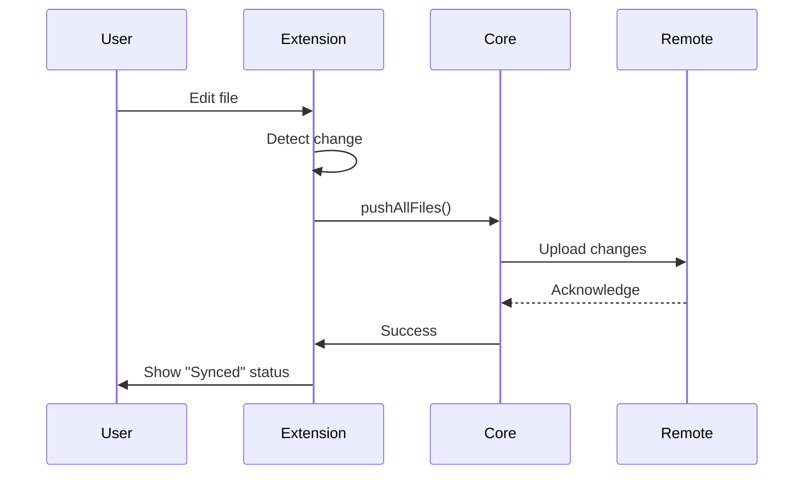

# VSCode Extension Specification

## Overview

uSpark VSCode 扩展旨在为开发者提供无缝的本地-远程文档同步体验，让用户能够在本地 IDE 中直接编辑和查看与 uSpark 项目同步的文档。

## User Story

**作为一个研发用户**，我希望：
- 从 VSCode 应用市场安装 uSpark 插件
- 在已经设置好同步的目录中工作
- 与 uSpark 的项目保持文档自动同步
- 在本地直接编辑文档
- 查看远程同步的文档

**以便于**：
- 使用熟悉的本地编辑器而不是 Web 界面
- 实时看到团队成员的文档更新
- 离线编辑，自动同步到云端
- 保持本地和远程文档的一致性

## Core Features

### 1. 自动安装与配置
- [ ] 从 VSCode Marketplace 发布和安装
- [x] 检测工作区中的 `.uspark.json` 或 `.uspark/.config.json`
- [x] 自动激活扩展

### 2. 双向同步
- [ ] **Pull**: 从远程拉取最新文档到本地
- [ ] **Push**: 将本地更改推送到远程
- [x] 定时自动同步（5分钟间隔）
- [ ] 文件变更监听触发同步
- [ ] 冲突检测与解决

### 3. 状态显示
- [x] 状态栏显示同步状态
  - "$(sync) Auto Sync" - 空闲状态
  - "$(sync~spin) Syncing..." - 同步中
  - "$(check) Synced" - 同步完成
- [ ] 同步历史记录
- [ ] 错误提示和日志

### 4. 用户交互
- [ ] 配置项设置（同步间隔、忽略文件等）
- [ ] 手动触发同步命令
- [ ] 查看同步状态命令
- [ ] 查看冲突和解决冲突

## Technical Architecture

### Directory Structure
```
apps/vscode-extension/
├── src/
│   ├── extension.ts          # 扩展入口，定时同步逻辑
│   ├── config.ts              # 配置加载（.uspark.json / .uspark/.config.json）
│   ├── sync/                  # 同步功能（待实现）
│   │   ├── pull.ts           # 拉取远程文档
│   │   ├── push.ts           # 推送本地更改
│   │   └── conflict.ts       # 冲突处理
│   └── __tests__/            # 单元测试
├── package.json              # 扩展清单
└── tsconfig.json             # TypeScript 配置
```

### Configuration Files

支持两种配置文件路径（优先级从高到低）：

1. **`.uspark.json`** - 项目根目录
```json
{
  "projectId": "project-id",
  "version": "1"
}
```

2. **`.uspark/.config.json`** - .uspark 目录
```json
{
  "projectId": "project-id",
  "version": "1"
}
```

配置加载逻辑：
- 返回 `configDir` 作为同步的工作目录
- 优先使用 `.uspark.json`
- 如果不存在，使用 `.uspark/.config.json`

### Sync Mechanism

#### Pull Flow


#### Push Flow


## Implementation Status

### ✅ Completed (v0.0.1)
- [x] 基础扩展框架
- [x] 配置文件加载（`.uspark.json` / `.uspark/.config.json`）
- [x] 状态栏显示
- [x] 定时同步触发（5分钟）
- [x] 单元测试（4个测试）
- [x] 集成到 turbo monorepo
- [x] CI/CD 流程

### 🚧 In Progress
- [ ] 实际同步逻辑实现
  - [ ] 使用 `@uspark/core` 的 `ProjectSync`
  - [ ] 使用 CLI 的 `pushAllFiles`

### 📋 Planned (v0.1.0)
- [ ] Pull 功能实现
- [ ] Push 功能实现
- [ ] 错误处理和用户提示
- [ ] 冲突检测
- [ ] 同步日志输出

### 📋 Future Enhancements
- [ ] 手动同步命令
- [ ] 配置项设置界面
- [ ] 选择性同步（忽略某些文件）
- [ ] 冲突解决界面
- [ ] 同步历史查看
- [ ] 离线模式支持
- [ ] 发布到 VSCode Marketplace

## Dependencies

### Required Packages
- `@uspark/core` - Core sync functionality
- `@uspark/cli` - File push utilities
- `vscode` - VSCode extension API

### VSCode API Usage
- `workspace.workspaceFolders` - 获取工作区路径
- `window.createStatusBarItem` - 状态栏显示
- `setInterval` - 定时同步

## Testing Strategy

### Unit Tests
- [x] Config loading from `.uspark.json`
- [x] Config loading from `.uspark/.config.json`
- [x] Config priority (`.uspark.json` > `.uspark/.config.json`)
- [x] Config not found scenario
- [ ] Sync pull functionality
- [ ] Sync push functionality
- [ ] Conflict detection

### Integration Tests
- [ ] End-to-end sync workflow
- [ ] Multiple workspace scenarios
- [ ] Error recovery

### Manual Testing
- [ ] Install and activate extension
- [ ] Verify auto-sync behavior
- [ ] Test with real uSpark projects

## Security Considerations

- Configuration files should not contain sensitive tokens
- Authentication should use uSpark's existing auth system
- File paths should be validated to prevent directory traversal
- Sync operations should respect file permissions

## Performance Considerations

- Sync interval: 5 minutes (configurable in future)
- Only sync changed files (delta sync)
- Debounce file change events
- Background sync to avoid blocking UI

## Error Handling

- Network errors: Retry with exponential backoff
- Authentication errors: Prompt user to re-authenticate
- File conflicts: Notify user, provide resolution options
- Configuration errors: Show error message in status bar

## Activation Events

Extension activates when:
- Workspace contains `.uspark.json`
- Workspace contains `.uspark/.config.json`

```json
{
  "activationEvents": [
    "workspaceContains:.uspark.json",
    "workspaceContains:.uspark/.config.json"
  ]
}
```

## Release Plan

### v0.0.1 (Current - Merged)
- Basic framework
- Config loading
- Status bar display
- Timer-based sync trigger (placeholder)

### v0.1.0 (Next)
- Implement actual sync (pull & push)
- Error handling
- Basic conflict detection

### v0.2.0
- Manual sync commands
- Configuration settings
- Conflict resolution UI

### v1.0.0
- Publish to VSCode Marketplace
- Full documentation
- Production-ready sync
- Offline mode support

## References

- [VSCode Extension API](https://code.visualstudio.com/api)
- [Publishing Extensions](https://code.visualstudio.com/api/working-with-extensions/publishing-extension)
- [@uspark/core documentation](../packages/core/README.md)
- [PR #749: VSCode Extension Basic Setup](https://github.com/uspark-hq/uspark/pull/749)
